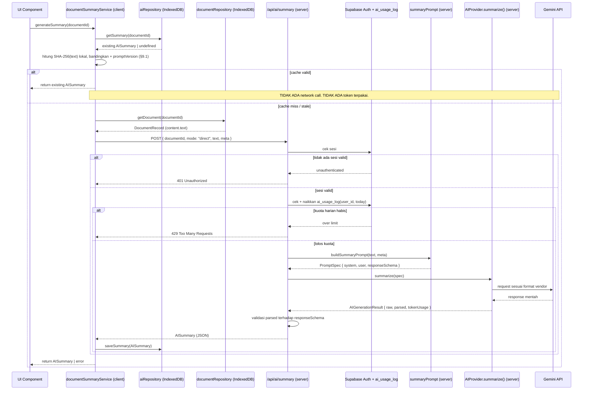
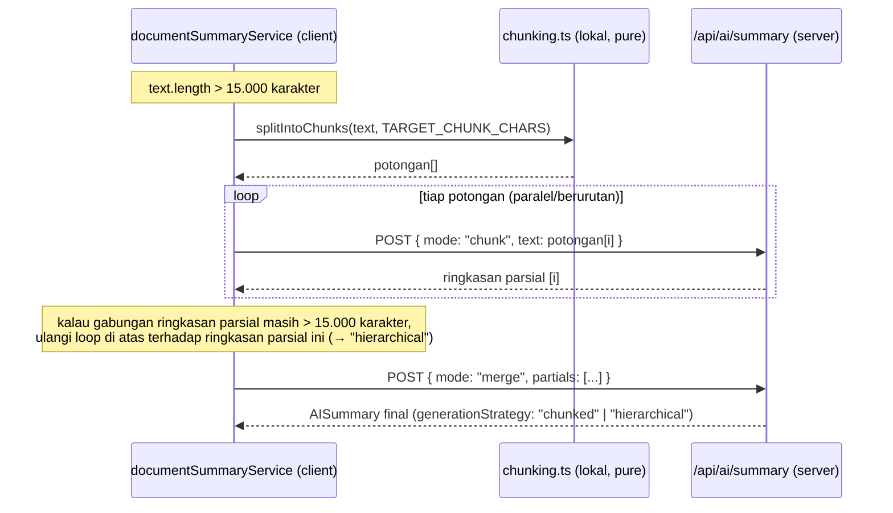

# AI Architecture Freeze — Summary → Flashcard → Quiz → Recommendation

[← Kembali ke Master Index](./ALL_DOCUMENTATION.md)

Status: **APPROVED — disetujui 17 Juli 2026 sebagai baseline implementasi.** Tiga keputusan terbuka §17.12 sudah diresolusikan final — lihat Riwayat Revisi #10.

Dokumen ini adalah **kontrak implementasi** untuk seluruh fitur AI (Summary, Flashcard, Quiz, Recommendation, dan fondasi untuk AI Chat di masa depan), mengikuti pola yang sama seperti `SPRINT_1_ARCHITECTURE_FREEZE.md`: begitu disetujui, implementasi wajib mengikuti dokumen ini, dan perubahan arsitektur di tengah jalan (rename, ubah shape interface, ubah storage strategy) berarti dokumen ini direvisi dan disetujui ulang dulu — bukan diubah diam-diam di kode.

Dokumen ini murni desain. **Tidak ada kode yang ditulis atau diubah** untuk menghasilkan dokumen ini. Referensi ke file (`src/lib/ai/types.ts`, dsb.) adalah kondisi *saat ini*, dipakai sebagai titik pijak evaluasi — bukan bukti bahwa file itu sudah diubah.

## Riwayat Revisi

Draft ini sudah melewati satu putaran review. Perubahan dari draft pertama, semuanya berdasarkan keputusan eksplisit di putaran review tersebut:

1. **Strategi dokumen panjang (chunking/hierarchical summary) — WAJIB, sekarang punya desain lengkap** (§6, baru). Sebelumnya cuma disebut sebagai keputusan terbuka.
2. **`Task`/`StudySession` resmi mendapat `sourceDocumentId`/`sourceSuggestionId`** (§3.2) — sebelumnya sengaja tidak diputuskan, sekarang dikonfirmasi ya.
3. **Auth wajib di seluruh `/api/ai/*`** (§7.3) — dari "gap yang diwariskan" menjadi syarat wajib sebelum Milestone D selesai, memakai `lib/supabase/server.ts` yang sudah ada.
4. **Cost Control / rate limiting** (§7.3, §8.4 baru) — tabel Supabase kecil (`ai_usage_log`), pengecualian sadar dan terbatas dari prinsip "Supabase hanya untuk auth".
5. **Cache key sekarang `documentId + SHA-256(text) + promptVersion`** (§9) — `promptVersion` yang berubah ikut membatalkan cache, bukan cuma metadata observability seperti draft pertama.
6. **`AIProvider` interface pakai method eksplisit per fitur** (`summarize`, `generateFlashcards`, `generateQuiz`, `recommend`, `chat`), bukan satu method generik `generate()` seperti draft pertama (§4) — hasil diskusi eksplisit soal trade-off eksplisit-vs-generik.
7. **Task Recommendation + Calendar Recommendation digabung jadi satu method provider (`recommend()`) dan satu panggilan AI**, bukan dua method/dua panggilan terpisah — dipilih demi kemudahan implementasi dan hemat token (lihat catatan keputusan di §4.3).
8. **Roadmap ditulis ulang memakai Milestone A–E** sesuai urutan yang diminta, bukan M1–M10 seperti draft pertama (§16).
9. **Bab baru "AI Contract & Structured Output" ditambahkan (§17)** — kontrak output JSON eksplisit per fitur, JSON Schema, Validation Pipeline, Error Handling, Retry Policy, dan aturan resmi Prompt Builder. **Beberapa konflik dengan §3 (domain model) ditemukan saat menyusun bab ini — sengaja BELUM diresolusikan di §3, hanya diflagging di §17.2 dan dirangkum di §17.12, menunggu keputusan eksplisit sebelum §3 ikut direvisi.**
10. **Resolusi final tiga keputusan terbuka (persetujuan eksplisit, 17 Juli 2026) — status dokumen naik DRAFT → APPROVED:**
   - **Quiz memakai `correctIndex`** (index ke array `options`), bukan `correctAnswer` teks — konsisten dengan urutan pilihan, mudah divalidasi, tidak bergantung pada perubahan teks jawaban.
   - **`AIRecommendationOutput` memakai satu array polymorphic** `recommendations[]` dengan diskriminator `type` — kontrak API tidak perlu berubah tiap ada tipe rekomendasi baru. **Penyimpanan (§3.1) tetap dua array bertipe** (`taskSuggestions`/`calendarSuggestions`); pemetaan output→storage terjadi di Business Validation (§17.4, Milestone D).
   - **Kategori `"Study"` resmi ada** di kontrak output, dan **dipetakan ke `AITaskSuggestion`** saat disimpan (sesuai proposal §17.2) — bukan kategori penyimpanan ketiga.
   - Konsekuensi pada §3.1 (resolusi §17.2 diterapkan): `AISummary` mendapat `difficulty`/`estimatedReadingTime`/`language`/`confidence`; set flashcard/quiz mendapat `title`; `difficulty` per card dan `explanation` per soal jadi wajib.
   - Konsekuensi kecil pada §5.1/§5.3 (mengikuti keputusan polymorphic): `taskPrompt.ts`/`calendarPrompt.ts` mengekspor **fragmen instruksi** (konstanta teks per jenis saran), bukan lagi fungsi `buildXFragment(summary)` — konteks ringkasan cukup disuntikkan sekali oleh `recommendationPrompt.ts`, dan JSON Schema gabungan hidup utuh di `recommendationPrompt.ts` karena bentuknya kini satu array seragam.

---

## 1. Tujuan

Document Processing Pipeline (Sprint 1–3) sudah selesai: seluruh jenis dokumen (image via OCR.Space, PDF/DOCX/XLSX/PPTX via parser lokal) menghasilkan `DocumentRecord.content.text` yang tersimpan di IndexedDB. Tujuan dokumen ini adalah membekukan arsitektur lapis berikutnya — **AI** — yang dibangun murni di atas teks hasil ekstraksi tersebut.

Aturan keras yang mengikat seluruh desain di bawah:

1. **AI hanya menerima teks hasil ekstraksi (normalized text). AI tidak pernah menerima file mentah** (PDF, DOCX, gambar, XLSX, PPTX, atau `Blob`/`File` apa pun). Semua file wajib melewati pipeline parser/OCR dulu (sudah selesai, Sprint 1–3) sebelum menyentuh AI sama sekali.
2. **UI tidak pernah memanggil Gemini (atau provider AI apa pun) secara langsung.** Satu-satunya jalur adalah `UI → AI Service (client) → API Route (server) → AI Provider → Gemini`.
3. **Prompt tidak pernah hardcoded di tempat pemanggilan.** Semua prompt lahir dari Prompt Builder yang reusable dan provider-agnostic.
4. **Token adalah biaya nyata, bukan detail implementasi.** Setiap keputusan desain di dokumen ini (caching, chunking, urutan pemanggilan) dievaluasi dulu dari sudut "apakah ini menghemat token" sebelum dari sudut kenyamanan kode.
5. **Dokumen panjang tidak pernah dikirim mentah dalam satu prompt tanpa batas.** Ukuran teks hasil ekstraksi menentukan strategi pengiriman (kirim langsung / chunking / hierarchical summary) — lihat §6.

Karena semua provider (Gemini, OpenAI, Claude, OpenRouter) menerima **bentuk input yang sama** (teks hasil ekstraksi + `PromptSpec` generik, bukan format khusus tiap vendor), mengganti provider tidak pernah berarti mengubah cara dokumen diproses — hanya mengubah siapa yang menjawab di ujung pipa.

---

## 2. Diagram Arsitektur

```
Upload
  ↓
Parser / OCR                    (SELESAI — Sprint 1-3, lib/document/*, lib/ocr/*)
  ↓
Extracted Text                  (DocumentRecord.content.text di IndexedDB `documents`)
  ↓
Normalize                       (sudah terjadi di pipeline dokumen — NormalizedContent)
  ↓
[BATAS BARU — mulai dari sini domain AI]
  ↓
AI Service (client)              services/ai/*.ts — orchestrator, TIDAK tahu provider mana yang aktif,
  ↓                               termasuk keputusan chunking (§6) kalau teks terlalu panjang
  │  fetch() ke route sendiri, pola identik documentService → /api/document/process
  ▼
AI Route (server)                app/api/ai/{summary,flashcard,quiz,recommendation}/route.ts
  │  Auth check → Rate-limit check → lanjut (detail §7.3)
  ▼
Prompt Builder                   lib/ai/prompts/*.ts — bangun PromptSpec (system+user+schema), pure function
  ↓
AI Provider                      lib/ai/getAIProvider.ts → provider aktif (env AI_PROVIDER)
  ↓
Gemini (atau OpenAI/Anthropic/OpenRouter)
```

Prinsip lapis (layering) yang dijaga ketat:

| Lapis | Tahu tentang | Tidak boleh tahu tentang |
|---|---|---|
| UI (komponen React) | AI Service (client) | Provider AI, Prompt Builder, API key, bentuk request ke Gemini |
| AI Service (client, `services/ai/*`) | Domain model AI, `aiRepository` (IndexedDB), route `/api/ai/*` miliknya sendiri, strategi chunking (§6) | Provider AI mana yang aktif, isi Prompt Builder, API key |
| AI Route (server, `app/api/ai/*/route.ts`) | Prompt Builder, `getAIProvider()`, sesi Supabase Auth, tabel `ai_usage_log` | IndexedDB (tidak ada di server), Zustand |
| Prompt Builder (`lib/ai/prompts/*`) | Bentuk domain model AI (untuk menyusun instruksi & schema output) | Provider AI mana pun, cara pemanggilan network |
| AI Provider (`lib/ai/providers/*`) | Cara bicara ke satu vendor AI spesifik (Gemini/OpenAI/dst), API key | Domain model AI (Summary/Flashcard/dst.), IndexedDB, prompt spesifik fitur |

---

## 3. AI Domain Model

### 3.1 Model inti

| Model | Isi | Permanen / Sementara |
|---|---|---|
| `AISummary` | `id, documentId, summaryVersion, title, summary, keyPoints[], keywords[], formulas?, difficulty, estimatedReadingTime, language, confidence, sourceTextHash, promptVersion, generationStrategy: "direct"\|"chunked"\|"hierarchical", provider, model, tokenUsage?, createdAt, updatedAt` | **Permanen** (IndexedDB `ai_summaries`) — mahal dihasilkan, jadi basis semua fitur turunan. *(`difficulty`/`estimatedReadingTime`/`language`/`confidence` ditambahkan saat resolusi §17.2 — Riwayat Revisi #10.)* |
| `AIFlashcardSet` | `id, documentId, summaryId, title, cards: {id, question, answer, difficulty}[], provider, model, tokenUsage?, createdAt` | **Permanen** (IndexedDB `ai_flashcards`) — satu set aktif per dokumen di MVP, ditimpa saat "Generate Ulang". *(`title` level-set ditambahkan & `difficulty` per card jadi wajib — resolusi §17.2.)* |
| `AIQuizSet` | `id, documentId, summaryId, title, questions: {id, question, options[], correctIndex, explanation, difficulty}[], provider, model, tokenUsage?, createdAt` | **Permanen** (IndexedDB `ai_quizzes`) — sama pola dengan `AIFlashcardSet`. *(`title` ditambahkan; `explanation` & `difficulty` per soal jadi wajib — resolusi §17.2.)* |
| `AIRecommendation` | `id, documentId, summaryId, taskSuggestions: AITaskSuggestion[], calendarSuggestions: AICalendarSuggestion[], provider, model, tokenUsage?, createdAt` | **Permanen** (IndexedDB `ai_recommendations`) selama status `pending`; jadi catatan historis pasif setelah semua isinya `applied`/`dismissed` |
| `AITaskSuggestion` | `id, title, description?, categoryHint?, priorityHint?, estimatedDurationMinutes?, dueDateHint?, reasoning, status: "pending"\|"applied"\|"dismissed", appliedTaskId?` | **Semi-permanen** — persisted sebagai bagian `AIRecommendation`, tapi hanya "waiting room". Begitu `applied`, ia bukan lagi input yang dipakai ulang AI mana pun, cuma log |
| `AICalendarSuggestion` | `id, title, suggestedDate, suggestedStartTime?, suggestedEndTime?, relatedTaskSuggestionId?, reasoning, status: "pending"\|"applied"\|"dismissed", appliedSessionId?` | **Semi-permanen** — sama pola dengan `AITaskSuggestion` |

**Catatan resolusi (Riwayat Revisi #10):** bentuk `AIRecommendation` di tabel di atas adalah bentuk **penyimpanan**. Output AI-nya sendiri berbentuk satu array polymorphic `recommendations[]` dengan field `type` (§17.2/§17.3) — Service memetakan item `type: "Task"|"Study"` → `AITaskSuggestion` dan `type: "Calendar"` → `AICalendarSuggestion` saat Business Validation (§17.4).

`generationStrategy` pada `AISummary` murni untuk observability (§6) — mencatat apakah ringkasan dihasilkan lewat jalur langsung, chunking, atau hierarchical summary, supaya kualitas hasil bisa ditelusuri kalau ada laporan "ringkasan dokumen tebal ini kurang detail".

### 3.2 Hubungan antar model

```
DocumentRecord (1)
      │  content.text
      ▼
  AISummary (0..1 aktif per dokumen)
      │  summaryId
      ├──────────────┬────────────────────┐
      ▼              ▼                    ▼
AIFlashcardSet   AIQuizSet          AIRecommendation
(0..1 aktif)     (0..1 aktif)       (0..1 aktif)
                                          │
                                 ┌────────┴────────┐
                                 ▼                 ▼
                        AITaskSuggestion[]  AICalendarSuggestion[]
                                 │                 │
                          (accept — manual)  (accept — manual)
                                 ▼                 ▼
                              Task              StudySession
                        (useAppStore,       (useAppStore,
                         sudah ada)           sudah ada)
                              │                    │
                    sourceDocumentId,      sourceDocumentId,
                    sourceSuggestionId     sourceSuggestionId
                    (field baru, optional) (field baru, optional)
```

Poin kunci:

- **Semua fitur turunan (Flashcard/Quiz/Recommendation) memakai `AISummary` sebagai konteks input, bukan `content.text` mentah lagi.** Ini bukan cuma mengikuti alur UI di brief (§11/Milestone E), tapi keputusan hemat-token yang disengaja: `AISummary` sudah dipadatkan (ratusan token) dibanding teks ekstraksi mentah (bisa ribuan token). Konsekuensinya: kualitas flashcard/quiz dibatasi oleh kualitas ringkasan — trade-off yang disadari, bukan celah. Efek samping penting: **ini juga yang membuat masalah chunking di §6 hanya perlu diselesaikan sekali**, di titik paling awal pipeline AI (generate summary), bukan berulang di tiap fitur.
- **Konversi `AITaskSuggestion → Task` dan `AICalendarSuggestion → StudySession` adalah aksi searah, manual, dan eksplisit oleh user** (klik "Tambahkan ke Tugas" / "Tambahkan ke Kalender"). Tidak ada sinkronisasi dua arah — setelah `Task` dibuat, ia sepenuhnya entity independen di `useAppStore`, tidak lagi terikat siklus hidup `AITaskSuggestion` sumbernya.
- **Keputusan final (sebelumnya terbuka, sekarang dikonfirmasi): `Task` dan `StudySession` (tipe yang sudah ada di `src/types/index.ts`) mendapat dua field baru, optional, additive:**
  - `sourceDocumentId?: string` — id dokumen asal.
  - `sourceSuggestionId?: string` — id `AITaskSuggestion`/`AICalendarSuggestion` asal.

  Ini perubahan pada tipe inti yang sudah dipakai luas di aplikasi (bukan tipe AI baru) — dicatat eksplisit di sini karena freeze ini yang mengizinkannya, bukan keputusan sepihak. Kedua field **optional**, jadi tidak breaking untuk `Task`/`StudySession` yang dibuat manual (tanpa AI) — nilainya `undefined` untuk semua task/jadwal yang sudah ada dan yang dibuat manual selanjutnya.

  **Kenapa dua field, bukan satu:** `sourceDocumentId` sendiri sudah cukup untuk menampilkan "Dibuat dari dokumen: Machine Learning.pdf" (join ke `UploadedFileMeta.filename`, pola yang sama seperti `DocumentRecord` join ke `UploadedFileMeta` — lihat §8, tidak menduplikasi filename). `sourceSuggestionId` ditambahkan terpisah supaya di masa depan bisa melihat detail rekomendasi asli (`reasoning`, dll.) lewat `AIRecommendation` yang menyimpannya, bukan cuma tahu dokumen sumbernya.

---

## 4. AI Provider Layer

### 4.1 Evaluasi interface saat ini

`src/lib/ai/types.ts` saat ini:

```
interface AIProvider {
  name: string;
  analyzeTask(task: Task): Promise<AIAnalysis>;
  chat(message: string, tasks: Task[], history: ChatMessage[]): Promise<string>;
  summarizeDocument(input: { text?: string; imageBlob?: Blob }): Promise<DocumentSummary>;
}
```

Dipilih lewat `getAIProvider()` (`env AI_PROVIDER`, default `mock`) — pola factory-nya **sudah benar dan cukup**, tidak perlu berubah struktural. Masalahnya ada di *method signature*-nya:

| Masalah | Detail |
|---|---|
| `summarizeDocument` menerima `imageBlob?: Blob` | Melanggar aturan §1.1 langsung — sisa desain dari sebelum OCR tersambung penuh. OCR sekarang selalu terjadi lebih dulu di pipeline dokumen; AI tidak pernah butuh menerima gambar lagi. |
| Satu method (`summarizeDocument`) menghasilkan summary+flashcard+quiz sekaligus | Tidak skalabel, dan bertentangan dengan alur "generate sesuai permintaan" di Milestone E. |
| Tidak ada tempat untuk `PromptSpec` reusable | Provider saat ini diharapkan tahu *apa* yang mau ditanyakan (bentuk prompt tersirat di implementasi provider), bukan hanya *bagaimana* menjalankannya — berisiko prompt hardcoded di tiap file provider, bukan di Prompt Builder terpusat. |
| Tidak ada token usage di return type | Tidak ada cara mengukur token yang benar-benar terpakai per panggilan — padahal token efficiency adalah fokus utama project. |

**Kesimpulan: interface saat ini belum cukup.** Perlu perubahan struktural — lihat §4.2.

### 4.2 Interface yang diusulkan (final)

**Keputusan (revisi dari draft pertama):** `AIProvider` memakai **method eksplisit per fitur**, bukan satu method generik. Setiap method tetap menerima `PromptSpec` (dihasilkan Prompt Builder) dan mengembalikan bentuk generik `AIGenerationResult` — jadi bagian yang generik/reusable (bentuk prompt, bentuk hasil) tetap ada, hanya *nama method*-nya yang eksplisit per fitur, bukan disatukan jadi satu `generate()`.

```
interface AIProvider {
  name: string;

  // Tidak diubah — dipakai /api/ai/analyze dan /api/ai/chat yang sudah ada,
  // rule-based hari ini, di luar cakupan freeze ini. Milestone E (§16) menyalakan
  // chat() dengan provider sungguhan, tapi signature-nya tidak berubah.
  analyzeTask(task: Task): Promise<AIAnalysis>;
  chat(message: string, tasks: Task[], history: ChatMessage[]): Promise<string>;

  // BARU — satu method eksplisit per fitur berbasis dokumen.
  summarize(spec: PromptSpec, options?: GenerateOptions): Promise<AIGenerationResult>;
  generateFlashcards(spec: PromptSpec, options?: GenerateOptions): Promise<AIGenerationResult>;
  generateQuiz(spec: PromptSpec, options?: GenerateOptions): Promise<AIGenerationResult>;
  recommend(spec: PromptSpec, options?: GenerateOptions): Promise<AIGenerationResult>;
}
```

Dengan bentuk generik yang tetap dipertahankan (sama seperti draft pertama):

- `PromptSpec` — `{ system: string; user: string; responseSchema?: JSONSchema }`, dihasilkan Prompt Builder (§5), tidak spesifik provider mana pun.
- `GenerateOptions` — `{ temperature?, maxOutputTokens? }`, parameter eksekusi generik.
- `AIGenerationResult` — `{ raw: string; parsed?: unknown; tokenUsage?: { promptTokens, completionTokens, totalTokens }; provider: string; model: string; finishReason?: string }`.

**Kenapa 4 method yang signature-nya nyaris identik, bukan 1 method generik:** dipilih secara eksplisit demi (a) kejelasan kontrak — implementer provider baru langsung tahu persis apa saja yang harus diisi tanpa membaca dokumentasi tambahan, dan (b) ruang untuk penyesuaian per-fitur nanti (mis. `generateQuiz` mungkin butuh `temperature` default lebih rendah daripada `summarize` supaya hasilnya lebih deterministik) tanpa perlu mengubah bentuk interface. Trade-off yang disadari: menambah fitur berbasis-dokumen baru di masa depan (bukan Flashcard/Quiz/Recommendation) berarti tetap menambah satu method baru di `AIProvider` **dan** di keempat provider — beda dari draft pertama yang mengklaim "tanpa mengubah fondasi" lewat method generik. Ini diterima sebagai konsekuensi sadar dari prioritas kejelasan interface, bukan diabaikan diam-diam.

**Catatan implementasi (bukan bagian kontrak publik):** kelima method berbasis-dokumen di atas kemungkinan besar punya pola pemanggilan vendor yang serupa (bangun request sesuai format vendor, kirim, uraikan response, hitung token). Setiap file provider **boleh** — tidak wajib, tidak bagian dari interface `AIProvider` — punya satu helper privat internal untuk pola berulang ini, dipanggil dari method-method publik di atas. Ini murni soal menghindari duplikasi kode di dalam satu file provider (mis. `providers/gemini.ts` boleh punya fungsi privat `callGemini(spec, options)` yang dipanggil dari `summarize`/`generateFlashcards`/`generateQuiz`/`recommend`) — tidak terlihat dari luar `lib/ai/providers/*`, dan tidak mengubah bentuk `AIProvider`.

**Ganti provider hanya lewat `AI_PROVIDER=`:** sudah terpenuhi oleh `getAIProvider.ts` yang ada sekarang, tidak berubah. Selama setiap provider mengimplementasikan kelima method di atas dengan kontrak yang sama, AI Service (§7) dan seluruh lapis di atasnya **tidak tahu dan tidak peduli** provider mana yang aktif.

### 4.3 Keputusan: Task Recommendation + Calendar Recommendation → satu method, satu panggilan

Draft pertama sempat memisahkan `taskPrompt.ts`/`calendarPrompt.ts` sebagai dua hal yang berpotensi jadi dua panggilan AI terpisah. Setelah dievaluasi ulang secara eksplisit dari sudut **kemudahan implementasi dan hemat token** (dua kriteria yang diminta dipakai untuk memutuskan ini):

**Keputusan: satu method `recommend()`, satu `PromptSpec` gabungan, satu panggilan Gemini, mengembalikan `{ taskSuggestions[], calendarSuggestions[] }` sekaligus.** *(Pasca-resolusi #10: bentuk mentah dari AI adalah `recommendations[]` polymorphic — §17.2/§17.3 — yang kemudian dipetakan ke kedua array ini saat Business Validation; hasil akhir yang tersimpan tetap seperti dinyatakan di sini.)*

Alasan kedua kriteria mengarah ke pilihan yang sama:

- **Lebih hemat token** — satu konteks (`AISummary`) yang sama dipakai untuk menghasilkan dua jenis saran; mengirimnya dua kali (sekali untuk task, sekali untuk calendar) adalah pemborosan konteks yang identik.
- **Lebih mudah diimplementasikan** — satu route (`/api/ai/recommendation`), satu Service method (`recommendationService.generateRecommendation()`), satu titik validasi output. Dua method/dua panggilan berarti dua kali lipat penanganan error, dua kali lipat kemungkinan salah satunya sukses dan satunya gagal (state parsial yang harus ditangani), dan koordinasi tambahan untuk menampilkannya sebagai satu hasil "Rekomendasi" yang koheren di UI.

**Konsekuensi pada Prompt Builder (§5):** `taskPrompt.ts` dan `calendarPrompt.ts` tetap ada sebagai file terpisah (sesuai permintaan pemisahan file), tapi masing-masing mengekspor **fragmen** (potongan instruksi + potongan JSON Schema), bukan `PromptSpec` berdiri sendiri. `recommendationPrompt.ts` adalah satu-satunya yang mengekspor `PromptSpec` utuh, menggabungkan kedua fragmen. Detail penuh di §5.3 — keputusan ini sebenarnya sudah konsisten dengan desain draft pertama di titik itu; yang berubah di revisi ini adalah level *provider* (`recommend()` tunggal, bukan `recommendTasks()`+`recommendCalendar()` terpisah), supaya konsisten dari Prompt Builder sampai Provider.

---

## 5. Prompt Builder

### 5.1 Struktur folder

```
src/lib/ai/prompts/
  types.ts                # PromptSpec, JSONSchema (alias sempit), PromptBuilder<TInput> = (input: TInput) => PromptSpec
  shared/
    formatting.ts         # fragmen instruksi bersama: "jawab dalam Bahasa Indonesia", "keluarkan JSON valid saja", tone
    schemas.ts             # fragmen JSON Schema bersama (shape flashcard, shape quiz option, dst.) — dipakai lintas prompt
  summaryPrompt.ts         # buildSummaryPrompt(text, meta) — mode langsung/final-merge
                            # buildChunkSummaryPrompt(chunkText, index, total) — mode ringkas-per-chunk, lihat §6
                            # buildMergeSummaryPrompt(partials[], meta) — mode gabungkan hasil chunk, lihat §6
  flashcardPrompt.ts       # buildFlashcardPrompt(summary: AISummary, count?: number) => PromptSpec
  quizPrompt.ts             # buildQuizPrompt(summary: AISummary, count?: number) => PromptSpec
  taskPrompt.ts             # TASK_SUGGESTION_FRAGMENT — FRAGMEN instruksi (konstanta), bukan PromptSpec utuh (§4.3, §5.3;
                            # bentuk konstanta — bukan fungsi(summary) — sejak resolusi polymorphic, Riwayat Revisi #10)
  calendarPrompt.ts         # CALENDAR_SUGGESTION_FRAGMENT — FRAGMEN, sama seperti di atas
  recommendationPrompt.ts   # buildRecommendationPrompt(summary: AISummary) => PromptSpec — MENGGABUNGKAN taskPrompt + calendarPrompt
```

### 5.2 Cara kerja

Setiap `buildXPrompt()` adalah **pure function**: tidak ada `fetch`, tidak ada akses IndexedDB, tidak ada import provider apa pun. Input berupa data yang sudah ada di tangan pemanggil (teks/`AISummary`/opsi), output berupa `PromptSpec` — data biasa, bukan objek yang "menjalankan" apa pun.

```
PromptSpec {
  system: string          // instruksi peran + aturan format, mis. "Kamu asisten belajar. Jawab hanya JSON valid sesuai schema."
  user: string             // konten spesifik: teks ringkasan/ekstraksi + instruksi tugas
  responseSchema?: object  // JSON Schema untuk output — dipakai provider utk structured output, dan divalidasi lagi di AI Service
}
```

Karena murni fungsi sinkron tanpa I/O, setiap Prompt Builder **bisa diuji unit test berdiri sendiri** tanpa API key, tanpa mock network — tinggal assert bentuk `PromptSpec` yang dihasilkan dari berbagai input. `summaryPrompt.ts` yang sekarang punya 3 export (§6) tetap satu file karena ketiganya adalah variasi dari satu domain persoalan yang sama (meringkas teks) — bukan pengecualian dari prinsip "jangan satu file besar", karena ketiganya kecil dan berhubungan langsung, bukan gado-gado fitur berbeda.

### 5.3 Kenapa `taskPrompt.ts`/`calendarPrompt.ts` bukan `PromptSpec` utuh

**Keputusan final (dikonfirmasi ulang di §4.3, disesuaikan resolusi polymorphic — Riwayat Revisi #10):** `taskPrompt.ts` dan `calendarPrompt.ts` masing-masing mengekspor **fragmen instruksi** (konstanta teks berisi panduan menghasilkan saran jenis Task/Study dan Calendar). `recommendationPrompt.ts` adalah satu-satunya yang mengekspor `PromptSpec` utuh — menggabungkan kedua fragmen jadi **satu** `system`+`user`, dengan **satu** `responseSchema` polymorphic (`{ recommendations: [...] }`, §17.3) yang hidup utuh di `recommendationPrompt.ts` sendiri (bentuknya kini satu array seragam, tidak perlu dua potongan schema terpisah). Hasilnya: satu panggilan Gemini (lewat `AIProvider.recommend()`, §4.3), satu tagihan token, satu array hasil yang dipetakan ke dua array penyimpanan (§3.1) saat Business Validation. `recommendationService` (§7) adalah satu-satunya pemanggil `buildRecommendationPrompt()` — `taskPrompt.ts`/`calendarPrompt.ts` tidak pernah dipakai langsung dari Service manapun.

### 5.4 Reusable lintas provider

Karena `PromptSpec` adalah data generik (dua string + satu JSON Schema opsional), **provider mana pun** bisa mengonsumsinya tanpa Prompt Builder tahu-menahu — pemetaan `PromptSpec → format request vendor` adalah tanggung jawab provider (§4.2), bukan Prompt Builder. Mengganti `AI_PROVIDER=gemini` menjadi `AI_PROVIDER=openai` tidak mengubah satu baris pun di `lib/ai/prompts/*`.

---

## 6. Strategi Dokumen Panjang — Chunking & Hierarchical Summary

**Wajib diputuskan sebelum implementasi** — mahasiswa akan mengupload skripsi, buku, modul 100 halaman. Mengirim seluruh isi ke Gemini dalam satu prompt tanpa batas berisiko tagihan token tidak proporsional dan lebih mudah kena limit context. Aturan berikut mengikat `documentSummaryService` (§7) — **satu-satunya** tempat teks mentah (`content.text`) pernah dikirim ke AI (lihat §3.2: fitur lain memakai `AISummary`, bukan teks mentah, jadi tidak perlu strategi chunking sendiri).

### 6.1 Aturan tiga-tingkat

| Ukuran hasil ekstraksi | Perlakuan | Jumlah panggilan AI |
|---|---|---|
| ≤ 15.000 karakter | Kirim seluruh isi langsung (`buildSummaryPrompt`, mode `direct`) | 1 |
| 15.000 – 80.000 karakter | Chunking — pecah jadi beberapa bagian, ringkas tiap bagian, gabungkan | N bagian + 1 (merge) |
| > 80.000 karakter | Hierarchical Summary — chunking diterapkan berulang/bertingkat sampai hasil gabungan cukup kecil untuk satu ringkasan akhir | N bagian + M bagian tingkat-2 (+ ... ) + 1 (merge akhir) |

Batas diukur dalam **karakter**, bukan token — cukup akurat untuk keputusan tingkat (tier) tanpa perlu library tokenizer tambahan, konsisten dengan cara `content.text` sudah diukur di tempat lain di codebase (`.length` biasa).

### 6.2 Bagaimana chunking bekerja

**Pemotongan teks jadi bagian (chunk) adalah operasi lokal murni — tidak butuh AI, tidak butuh secret apa pun.** Karena itu, pemotongan boleh dan sebaiknya terjadi **di client** (`services/ai/documentSummaryService.ts`), bukan di route server — sebuah utilitas pure function baru:

```
lib/ai/chunking.ts
  splitIntoChunks(text: string, targetChunkChars: number): string[]
```

Pemotongan mengutamakan batas paragraf (baris kosong ganda), baru turun ke batas kalimat kalau satu paragraf sendiri sudah melebihi target — supaya tidak pernah memotong di tengah kalimat/kata, yang akan menurunkan kualitas ringkasan per bagian. Ukuran target per chunk adalah satu konstanta (`TARGET_CHUNK_CHARS`, disarankan mulai dari ±8.000 karakter) — bisa disetel tanpa mengubah struktur mana pun, bukan angka ajaib yang tersebar di banyak tempat.

**Kenapa orkestrasi multi-panggilan terjadi di client, bukan di dalam satu route server:** kalau satu route (`/api/ai/summary`) diminta melakukan seluruh rangkaian panggilan (puluhan chunk + merge) dalam satu siklus request-response, request itu berisiko melebihi batas waktu eksekusi function serverless (Next.js Route Handler di Vercel dkk. punya batas durasi). Dengan orkestrasi di client, setiap panggilan HTTP ke `/api/ai/summary` tetap kecil dan cepat (persis satu panggilan AI per request, bentuk yang sama seperti mode `direct`), risiko timeout hilang, dan sebagai bonus ini membuka jalan untuk menampilkan progres granular di UI nanti ("Meringkas bagian 3 dari 12...") — tidak wajib diimplementasikan sekarang, tapi desain ini tidak menghalanginya.

### 6.3 Alur (berlaku sama untuk tingkat 15k–80k dan >80k)

```
documentSummaryService.generateSummary(documentId):
  1. cache-check seperti biasa (§9) — kalau valid, berhenti di sini, nol panggilan AI
  2. text = DocumentRecord.content.text
  3. jika text.length ≤ 15.000:
        hasil = panggil /api/ai/summary { mode: "direct", text }
        strategy = "direct"
  4. jika text.length > 15.000:
        potongan = splitIntoChunks(text, TARGET_CHUNK_CHARS)
        selama gabungan-panjang(potongan) masih > 15.000 karakter:
            ringkasanParsial = panggil /api/ai/summary { mode: "chunk", text: potongan[i] }  — untuk tiap potongan
            potongan = regroup(ringkasanParsial)   # jadi input tingkat berikutnya kalau masih terlalu besar
        hasil = panggil /api/ai/summary { mode: "merge", partials: potongan, meta }
        strategy = (loop di atas berjalan lebih dari 1 putaran) ? "hierarchical" : "chunked"
  5. simpan AISummary (termasuk field generationStrategy = strategy) via aiRepository
  6. return
```

Untuk dokumen di tingkat 15k–80k, loop di langkah 4 biasanya cukup **satu putaran** (chunk → langsung merge) → tercatat sebagai `"chunked"`. Untuk dokumen >80k, satu putaran ringkasan-per-chunk sering masih menghasilkan gabungan yang terlalu besar untuk di-merge langsung, sehingga loop berjalan lagi (meringkas kumpulan ringkasan-tingkat-1 jadi ringkasan-tingkat-2, dst.) sampai cukup kecil — tercatat sebagai `"hierarchical"`. **Hierarchical Summary bukan mekanisme terpisah dari chunking** — ia adalah chunking yang diterapkan berulang sampai konvergen. Ini menyederhanakan implementasi: hanya ada satu jalur orkestrasi (langkah 4 di atas), bukan dua jalur kode berbeda untuk tingkat 2 dan tingkat 3.

Route (`/api/ai/summary`) sendiri tetap sederhana dan tidak berubah bentuk — menerima `{ mode: "direct"|"chunk"|"merge", text?, partials?, meta? }`, memilih Prompt Builder yang sesuai (`buildSummaryPrompt` untuk `direct`, `buildChunkSummaryPrompt` untuk `chunk`, `buildMergeSummaryPrompt` untuk `merge`), memanggil `provider.summarize(spec)`, mengembalikan hasil. Route tidak tahu dan tidak peduli sedang berada di tengah alur chunking atau tidak — setiap panggilan adalah satu unit kerja mandiri.

### 6.4 Batasan yang disadari (tidak diselesaikan di freeze ini)

- **Tidak ada resume dari kegagalan parsial.** Kalau salah satu panggilan chunk gagal di tengah jalan (dokumen 80 chunk, gagal di chunk ke-45), seluruh `generateSummary()` gagal dan harus diulang dari awal (mengulang seluruh chunk, bukan cuma yang gagal). Diterima sebagai batasan MVP — retry penuh lebih sederhana daripada melacak progres parsial, dengan konsekuensi dokumen sangat panjang yang gagal di tengah jalan lebih mahal untuk dicoba ulang.
- **"Ambil bagian penting" (istilah di tingkat 15k–80k) tidak diimplementasikan sebagai langkah penyaringan terpisah** (mis. heuristik membuang daftar isi/daftar pustaka sebelum chunking) — efeknya dicapai secara implisit lewat proses ringkas-per-chunk itu sendiri (tiap chunk dipadatkan ke poin pentingnya, konten berbobot rendah otomatis terkompresi saat diringkas). Kalau yang dimaksud adalah heuristik penyaringan eksplisit sebelum chunking, itu penambahan terpisah yang belum dirancang di sini.

---

## 7. AI Service Layer

### 7.1 Struktur

```
src/services/ai/
  aiRepository.ts            # CRUD IndexedDB untuk 4 store baru (client-only) — pola identik documentRepository.ts
  documentSummaryService.ts  # generateSummary(documentId): Promise<AISummary> — termasuk orkestrasi chunking §6
  flashcardService.ts        # generateFlashcards(documentId): Promise<AIFlashcardSet>
  quizService.ts              # generateQuiz(documentId): Promise<AIQuizSet>
  recommendationService.ts    # generateRecommendation(documentId): Promise<AIRecommendation>
```

Empat service, satu tanggung jawab masing-masing, semuanya mengikuti urutan langkah yang sama (dicontohkan dengan `documentSummaryService.generateSummary`, versi lengkap termasuk chunking ada di §6.3):

1. Baca `DocumentRecord` via `documentRepository` (IndexedDB, client-only, sudah ada) → ambil `content.text`.
2. **Cek cache** via `aiRepository.getSummary(documentId)` — kalau ada dan valid (§9) → **return cached, selesai, tidak ada network call sama sekali.**
3. Kalau tidak ada / stale: tentukan strategi (`direct`/`chunked`/`hierarchical`, §6) dan kirim satu atau lebih request ke route sendiri.
4. Terima `AISummary` (JSON) dari route.
5. Simpan via `aiRepository.saveSummary(record)`.
6. Return ke pemanggil (UI).

`flashcardService`/`quizService`/`recommendationService` mengikuti pola identik, bedanya hanya: input mereka adalah `AISummary` (bukan `content.text` mentah — §3.2, dan karena itu **tidak butuh strategi chunking sendiri**, `AISummary` sudah dijamin ringkas), dan mereka duluan memastikan `AISummary` aktif sudah ada (memanggil `documentSummaryService.generateSummary()` dulu kalau belum) sebelum lanjut ke fitur masing-masing.

### 7.2 Kenapa Prompt Builder dipanggil di server, bukan di Service (client)

Sama seperti draft pertama: **Service di `src/services/ai/*` adalah client-only** (butuh `documentRepository`/`aiRepository`, bergantung IndexedDB — tidak ada di server). Memanggil Gemini butuh API key — **wajib server-only**. `buildSummaryPrompt()` dkk. (Prompt Builder) **diimpor dan dipanggil di dalam route handler**, bukan di Service. Service client hanya mengirim `text`/`AISummary` mentah + parameter mode; route yang membangun prompt, memanggil provider, dan mengembalikan hasil jadi. Server **tidak menyimpan hasil AI** — penyimpanan ke `aiRepository` (IndexedDB) tetap sepenuhnya tanggung jawab Service di client.

### 7.3 Rute API baru — termasuk Auth & Cost Control (wajib)

| Route | Input | Output | Satu-satunya pemanggil |
|---|---|---|---|
| `POST /api/ai/summary` | `{ documentId, mode: "direct"\|"chunk"\|"merge", text?, partials?, meta }` | `AISummary`-shaped JSON (tanpa field storage) | `documentSummaryService.ts` |
| `POST /api/ai/flashcard` | `{ documentId, summary: AISummary, count? }` | `AIFlashcardSet`-shaped JSON | `flashcardService.ts` |
| `POST /api/ai/quiz` | `{ documentId, summary: AISummary, count? }` | `AIQuizSet`-shaped JSON | `quizService.ts` |
| `POST /api/ai/recommendation` | `{ documentId, summary: AISummary }` | `AIRecommendation`-shaped JSON (`taskSuggestions`/`calendarSuggestions` berstatus `pending`) | `recommendationService.ts` |

**Setiap route wajib melewati dua gerbang ini, dalam urutan ini, sebelum menyentuh Prompt Builder atau provider:**

1. **Auth check (wajib, bukan opsional).** Baca sesi lewat `lib/supabase/server.ts` (sudah ada, dipakai pola yang sama seperti direkomendasikan `docs/15_SECURITY.md`). Tidak ada sesi valid → **`401 Unauthorized`**, berhenti di situ. Provider **tidak pernah** dipanggil untuk request tanpa sesi.
2. **Rate-limit check (Cost Control, wajib).** Baca/naikkan counter harian di tabel Supabase baru `ai_usage_log` (§7.4) untuk `(user_id, tanggal_hari_ini)`. Kalau counter sudah mencapai batas harian → **`429 Too Many Requests`**, berhenti di situ, provider **tidak pernah** dipanggil. Kalau lolos, counter dinaikkan **sebelum** memanggil provider (bukan sesudah — supaya permintaan yang gagal di tengah jalan tidak bisa dipakai untuk mengelak dari batas lewat retry cepat berulang).

   **Kebijakan kalau pengecekan rate-limit itu sendiri gagal dieksekusi** (mis. Supabase sedang bermasalah): **fail-closed** — permintaan **ditolak** (`503 Service Unavailable`, dibedakan dari `429` supaya UI bisa menampilkan pesan yang tepat — "coba lagi sebentar" vs "kuota harian habis"), bukan diloloskan. Alasan: satu-satunya skenario di mana pengecekan ini gagal dijalankan adalah persis skenario di mana perlindungan biaya paling dibutuhkan — meloloskan request di saat pengaman tidak bisa diverifikasi berarti menghapus pengaman itu sendiri tepat ketika paling berisiko.
3. Validasi input (400 kalau field wajib kosong/tidak sesuai — pola sama dengan validasi yang sudah ada di `/api/document/process`).
4. Prompt Builder → bangun `PromptSpec`.
5. `getAIProvider().summarize/generateFlashcards/generateQuiz/recommend(spec)`.
6. **Validasi hasil terhadap `responseSchema`** — gagal → error terstruktur, bukan hasil rusak diteruskan ke client.
7. Response JSON.

### 7.4 Tabel baru: `ai_usage_log` (Supabase) — pengecualian sadar dari "Supabase hanya untuk auth"

`docs/04_AUTHENTICATION.md` menetapkan batas keras: Supabase hanya untuk register/login/logout/session/profil dasar, **tidak untuk data aplikasi apa pun** — termasuk eksplisit disebut "ringkasan AI" dalam daftar yang tetap harus lokal. Rate-limiting yang benar (bertahan lintas cold start dan lintas instance serverless — lihat §7.3) butuh state tersimpan di server, yang berarti **harus** keluar dari IndexedDB (tidak ada di server) dan opsi paling murah/tanpa infrastruktur baru adalah Supabase yang sudah ada.

**Keputusan: tambah satu tabel kecil, `ai_usage_log`, khusus counter — bukan pembatalan prinsip "Supabase hanya untuk auth", melainkan perluasan sempit dan terdokumentasi darinya.** Perbedaan yang dijaga ketat: **konten AI (`AISummary`/`AIFlashcardSet`/`AIQuizSet`/`AIRecommendation`) tetap 100% di IndexedDB, tidak pernah masuk Supabase** — yang masuk Supabase murni angka penghitung (`user_id`, tanggal, jumlah panggilan), terikat langsung ke identitas auth yang memang sudah menjadi tanggung jawab Supabase di project ini.

Bentuk tabel (desain, bukan migrasi — implementasi sungguhan menyusul di Milestone D):

| Kolom | Tipe | Catatan |
|---|---|---|
| `user_id` | uuid | FK ke `auth.users.id`, sama seperti `profiles` |
| `usage_date` | date | Bucket harian, bukan timestamp presisi |
| `request_count` | integer | Dinaikkan tiap kali salah satu dari 4 route di §7.3 lolos auth+rate-limit dan akan memanggil provider |

RLS mengikuti pola yang sudah ada di seluruh tabel Supabase project ini (`(select auth.uid()) = user_id`, lihat `docs/05_DATABASE.md`) — tidak perlu pola baru. Batas harian pastinya (angka `request_count` maksimum) adalah keputusan produk, bukan arsitektur — disarankan mulai dari angka konservatif yang mudah disesuaikan tanpa mengubah struktur tabel (mis. lewat env var), bukan angka yang di-hardcode tersebar di beberapa route.

**Tindak lanjut dokumentasi (dicatat di roadmap §16, bukan dilakukan di freeze ini):** begitu tabel ini benar-benar diimplementasikan (Milestone D), pernyataan batas di `docs/04_AUTHENTICATION.md` ("Supabase TIDAK digunakan untuk menyimpan data aplikasi apapun") perlu diperbarui untuk mencatat pengecualian sempit ini secara eksplisit — dokumen itu menjelaskan kondisi *saat ini*, jadi baru diperbarui saat kondisinya benar-benar berubah, bukan sekarang saat freeze ini masih draft.

### 7.5 Dependency yang benar

- **Processor (`lib/document/*`) tidak tahu AI** — tidak berubah.
- **UI tidak tahu Provider** — tidak berubah.
- **Service (client) tidak tahu Provider** — tidak berubah, Service hanya kirim data mentah ke route miliknya sendiri.
- **Route (server) tidak tahu IndexedDB** — tidak berubah.
- **Route (server) sekarang juga bicara ke Supabase** (auth session + `ai_usage_log`) — dependency baru yang perlu dicatat eksplisit, berbeda dari draft pertama yang mengasumsikan route AI sama sekali tidak menyentuh Supabase.

---

## 8. Penyimpanan Data AI

### 8.1 Evaluasi `DocumentRecord` saat ini

Sprint 1 freeze (§4 dokumen itu) *merencanakan* field `summary?` yang direservasi di `DocumentRecord`, dengan asumsi awal "AI Summary nanti nempel di sini" — **audit Juli 2026 menemukan field itu tidak pernah benar-benar ditambahkan** ke `src/types/index.ts` (hanya `retentionPolicy?` yang ada). Kesimpulan bab ini tidak berubah, malah makin sederhana: pendekatan field-menempel-di-`DocumentRecord` **tidak dipakai** — dan karena field-nya memang tidak pernah ada, tidak ada yang perlu di-deprecate.

### 8.2 Keputusan: pisah jadi store IndexedDB tersendiri

**Rekomendasi: DIPISAH** (tidak berubah dari draft pertama). Bukan `DocumentRecord.summary`/`.flashcards`/`.quiz` sebagai field bertumpuk, melainkan store IndexedDB baru per tipe:

```
DocumentRecord   (sudah ada, TIDAK diubah — field `summary?` dibiarkan ada di tipe tapi tidak pernah diisi lagi, deprecated)
      │  relasi by documentId (join, bukan nested field — pola sama seperti DocumentRecord ↔ UploadedFileMeta)
      ▼
ai_summaries        (IndexedDB store baru) → AISummary
ai_flashcards       (IndexedDB store baru) → AIFlashcardSet
ai_quizzes          (IndexedDB store baru) → AIQuizSet
ai_recommendations  (IndexedDB store baru) → AIRecommendation
```

**Alasan (ringkas — detail penuh sama seperti draft pertama):**

1. Frekuensi tulis berbeda jauh antara `AISummary` dan turunannya — membundel semua jadi field `DocumentRecord` berarti tiap generate satu fitur AI menulis ulang seluruh `DocumentRecord` termasuk `content.text` yang bisa besar.
2. `DocumentRecord` tidak boleh tahu tentang setiap fitur AI yang akan pernah ada (Future Scalability, §12).
3. Presedennya sudah ada — `DocumentRecord` sengaja tidak menduplikasi `filename`/`size`/`mimeType` dari `UploadedFileMeta`, keduanya di-join by id.
4. Cache invalidation lebih presisi — regenerasi `AISummary` tidak otomatis menulis ulang `AIFlashcardSet`/`AIQuizSet`, cukup dicek staleness lewat `summaryId` (§9) saat dibutuhkan.

### 8.3 Skema IndexedDB (bump versi)

`DB_VERSION` naik dari `2` → `3` (additive — `upgrade()` di `lib/indexedDb.ts` cukup ditambah 4 `createObjectStore` baru, `files`/`documents` tidak disentuh):

| Store | Key | Isi |
|---|---|---|
| `files` (sudah ada) | `id` | Blob mentah |
| `documents` (sudah ada) | `id` | `DocumentRecord` |
| `ai_summaries` (baru) | `documentId` | `AISummary` |
| `ai_flashcards` (baru) | `documentId` | `AIFlashcardSet` |
| `ai_quizzes` (baru) | `documentId` | `AIQuizSet` |
| `ai_recommendations` (baru) | `documentId` | `AIRecommendation` |

`aiRepository.ts` (`services/ai/`) adalah **satu-satunya** pintu baca/tulis keempat store ini — pola identik `documentRepository.ts` (client-only).

**Tidak ada satu pun konten AI yang masuk localStorage/Supabase.** Satu-satunya data terkait-AI yang masuk Supabase adalah counter `ai_usage_log` (§7.4) — angka, bukan konten. `AISummary`/`AIFlashcardSet`/dst. hanya hidup di IndexedDB, prinsip yang sama dari Sprint 1 §7 berlaku identik di sini.

---

## 9. Caching Strategy

Tujuan: "Sudah pernah Summary → buka lagi dokumen → tidak memanggil Gemini lagi." Ini **bukan** optimisasi tambahan — ini jalur wajib yang harus dilewati sebelum request keluar ke provider mana pun.

### 9.1 Kunci cache (revisi — `promptVersion` sekarang bagian dari validitas, bukan cuma metadata)

**Keputusan final:** cache valid **hanya jika ketiganya cocok sekaligus**:

```
documentId  +  SHA-256(normalize(text))  +  promptVersion
```

- **`documentId`** — kunci utama record di `aiRepository` (§8.3).
- **`SHA-256(normalize(text))`** — dihitung lewat Web Crypto API (`crypto.subtle.digest("SHA-256", ...)`), tersedia native di browser maupun runtime server, **tidak perlu dependency baru**. `normalize()` sekadar trim whitespace berlebih sebelum di-hash, supaya tidak beda hash gara-gara whitespace yang tidak signifikan secara isi. Dihitung **di client** (dalam `documentSummaryService`, sebelum ada fetch apa pun) supaya cache-check tidak butuh round-trip network sama sekali untuk kasus cache-hit.
- **`promptVersion`** — konstanta yang naik tiap kali isi Prompt Builder (`summaryPrompt.ts` dkk.) berubah signifikan. **Berbeda dari draft pertama:** sekarang ikut menentukan valid/tidaknya cache, bukan sekadar dicatat untuk observability. Kalau `promptVersion` yang tersimpan di record ≠ `promptVersion` konstanta saat ini di kode → cache dianggap **tidak valid**, regenerasi otomatis terjadi di pemakaian berikutnya.

  **Konsekuensi yang disadari:** mengubah prompt (memperbaiki kata-kata instruksi, menambah field baru di schema, dst.) membatalkan cache **semua** dokumen semua user sekaligus — pemanggilan berikutnya ke tiap dokumen yang pernah diringkas akan memicu regenerasi berbayar. Ini dipilih secara sadar (bukan draft pertama yang justru sengaja menghindarinya) karena **konsistensi hasil dianggap lebih penting daripada penghematan token dalam kasus ini** — user tidak boleh melihat gabungan hasil dari dua versi prompt berbeda tanpa disadari. Perubahan prompt karena itu perlu diperlakukan sebagai keputusan yang disengaja (tahu konsekuensi biayanya), bukan editan santai.

- `AIFlashcardSet`/`AIQuizSet`/`AIRecommendation` divalidasi lewat `summaryId` (apakah cocok dengan `AISummary.id` yang aktif sekarang) — tidak berubah dari draft pertama, tetap transitif terhadap validitas `AISummary` yang sudah tervalidasi terhadap `sourceTextHash`+`promptVersion` duluan.

### 9.2 Alur cek cache (berlaku sama di keempat service)

```
generateX(documentId):
  existing = aiRepository.getX(documentId)
  if existing exists AND existing masih valid (§9.1):
      return existing        # ZERO network call, ZERO token terpakai
  else:
      result = fetch("/api/ai/x", ...)   # baru keluar network di sini
      aiRepository.saveX(result)
      return result
```

Karena pengecekan ini hidup di **Service** (bukan di komponen UI), tidak ada jalan pintas yang bisa melewatinya.

### 9.3 "Generate Ulang" (regenerasi eksplisit)

Kalau cache valid, ia tetap dipakai **walau user membuka ulang dokumen berkali-kali**. Satu-satunya jalan memaksa pemanggilan baru adalah aksi eksplisit user ("Generate Ulang"), yang secara sengaja **melewati** pengecekan cache (parameter `force: true` pada method Service) — harus jelas terlihat sebagai tombol terpisah di UI (§11), bukan otomatis atau tersembunyi.

Regenerasi `AISummary` (`summaryId` baru) membuat `AIFlashcardSet`/`AIQuizSet`/`AIRecommendation` lama **stale** (bukan langsung terhapus) — UI menampilkan badge "sumber berubah, generate ulang?" (§11).

---

## 10. Token Optimization

| Lapis | Bagaimana menghemat token |
|---|---|
| **OCR + Parser Lokal** (sudah selesai) | AI tidak pernah menerima gambar/PDF/dokumen mentah — hanya string hasil ekstraksi. |
| **Ekstraksi terjadi sekali, dipakai berkali-kali** | `content.text` diekstrak sekali saat upload, disimpan permanen di `DocumentRecord`. |
| **Ringkasan sebagai basis fitur turunan (§3.2)** | Flashcard/Quiz/Recommendation memakai `AISummary` (ratusan token) sebagai konteks, bukan `content.text` mentah. |
| **Strategi bertingkat untuk dokumen panjang (§6)** | Dokumen di atas 15.000 karakter tidak pernah dikirim utuh dalam satu prompt — dipecah dan diringkas bertahap, mencegah tagihan token yang tidak proporsional untuk satu dokumen tebal. |
| **Caching (§9)** | Membuka ulang dokumen yang sudah pernah diringkas = nol panggilan AI (selama teks & versi prompt tidak berubah). |
| **Generate sesuai permintaan, bukan otomatis** | Summary/Flashcard/Quiz/Recommendation masing-masing dipicu klik eksplisit user (§11) — bukan auto-generate saat upload. |
| **Task + Calendar Recommendation digabung (§4.3)** | Satu panggilan AI untuk dua jenis saran sekaligus, bukan dua panggilan terpisah. |
| **Rate limiting (§7.3, §7.4)** | Bukan penghematan per-panggilan, tapi pembatas total — mencegah satu akun (disengaja atau karena bug di client) menghabiskan kuota lewat panggilan berulang tak terbatas. |
| **`responseSchema` (structured output)** | Output JSON Schema-constrained cenderung lebih ringkas & deterministik, mengurangi token completion yang terbuang dan mengurangi retry akibat format tidak valid. |

---

## 11. AI UI (desain, belum implementasi)

Alur sesuai brief, semua berakar dari satu `AISummary`:

```
[Dokumen dibuka]
      │
      ▼
Tombol "Buat Ringkasan AI"   ← generate on-demand, TIDAK otomatis saat upload (hemat token, §10)
      │  (kalau AISummary sudah ada & valid → langsung tampil, tanpa loading/network)
      │  (kalau dokumen panjang → indikator progres selama chunking berjalan, §6.2)
      ▼
Ringkasan AI
      │
      ├─ Poin Penting (keyPoints[])
      ├─ Keyword (keywords[])
      │
      ├─ Tombol "Buat Flashcard"       → AIFlashcardSet (cached per documentId)
      ├─ Tombol "Buat Quiz"             → AIQuizSet (cached per documentId)
      └─ Tombol "Buat Rekomendasi"      → AIRecommendation (satu panggilan, §4.3)
                                              ├─ Saran Tugas → tombol "Tambahkan ke Tugas" (per item, manual)
                                              │                 → Task baru: sourceDocumentId + sourceSuggestionId terisi (§3.2)
                                              └─ Saran Kalender → tombol "Tambahkan ke Kalender" (per item, manual)
                                                                → StudySession baru: sourceDocumentId + sourceSuggestionId terisi
```

Task/StudySession yang dibuat dari saran AI menampilkan jejak asalnya di UI (mis. "Dibuat dari dokumen: Machine Learning.pdf") — didapat dengan join `sourceDocumentId → UploadedFileMeta.filename` saat render, bukan menyimpan filename dobel (§3.2).

Prinsip UI yang mengikat implementasi nanti:

- Setiap tombol "Buat X" memanggil `xService.generateX(documentId)` — **selalu** lewat cache-check di §9.
- Kalau cache stale (§9.3), UI menampilkan indikator jelas ("Ringkasan diperbarui — flashcard ini dari versi sebelumnya") dengan tombol "Generate Ulang" — bukan diam-diam menampilkan hasil lama seolah-olah terbaru.
- Rekomendasi task/calendar ditampilkan sebagai **saran**, bukan langsung masuk daftar Task/Jadwal aktif — user tetap pemilik keputusan akhir (aksi manual per §3.2).

---

## 12. Future Scalability

| Fitur | Status terhadap desain ini |
|---|---|
| Flashcard | Tercakup penuh (§3, §5, §7) |
| Quiz | Tercakup penuh (§3, §5, §7) |
| Task Recommendation | Tercakup penuh, digabung dengan Calendar Recommendation jadi satu method/satu panggilan (§4.3) |
| Calendar Recommendation | sda |
| **AI Assistant** (Milestone E — mengaktifkan `chat()` yang **sudah ada** di `AIProvider`, dipakai `/api/ai/chat`, rule-based hari ini) | Tidak butuh perubahan fondasi — signature `chat()` sudah ada dan tidak berubah. Milestone E (§16) mengisi implementasi provider sungguhan untuk method ini, menggantikan logika keyword-matching yang berjalan hari ini. **Ini fitur asisten umum, bukan spesifik satu dokumen** — asumsi yang dipakai freeze ini; kalau yang dimaksud brief sebenarnya chat khusus per-dokumen, itu fitur berbeda, lihat baris di bawah. |
| **AI Chat berbasis dokumen** (belum diminta implementasi — beda dari "AI Assistant" di atas) | **Tidak butuh perubahan fondasi kalau nanti dibutuhkan.** Ditambah sebagai: `chatPrompt.ts` (Prompt Builder baru, menerima riwayat percakapan + `AISummary` sebagai konteks) + `documentChatService.ts` (Service baru) + `POST /api/ai/document-chat` (route baru) + satu method baru `chatAboutDocument()` di `AIProvider` (konsekuensi dari §4.2: method eksplisit berarti fitur baru = method baru, diterima sebagai trade-off sadar). `PromptSpec`/`AIGenerationResult` dipakai apa adanya, tidak berubah. |

---

## 13. Dependency Diagram

```
┌─────────────────────────────────────────────────────────────────────┐
│ CLIENT (browser)                                                      │
│                                                                        │
│  UI Components                                                        │
│       │ panggil                                                       │
│       ▼                                                               │
│  services/ai/{documentSummary,flashcard,quiz,recommendation}Service   │
│       │ baca/tulis            │ splitIntoChunks (§6, lokal)           │
│       │                       │ fetch (hanya kalau cache miss,        │
│       ▼                       │ bisa berkali-kali kalau chunking)     │
│  services/ai/aiRepository     ▼                                       │
│       │              (lintas boundary client→server)                  │
│       ▼                                                                │
│  IndexedDB: ai_summaries / ai_flashcards / ai_quizzes /                │
│             ai_recommendations                                         │
│                                                                        │
│  services/document/documentRepository  ← dibaca oleh AI Service       │
│  (untuk ambil DocumentRecord.content.text — TIDAK berubah)            │
└─────────────────────────────────────────────────────────────────────┘
                                │
                                │  fetch() — hanya JSON, tidak pernah blob/file.
                                │  Cookie sesi Supabase ikut terkirim otomatis
                                │  (sama origin) untuk auth check di server.
                                ▼
┌─────────────────────────────────────────────────────────────────────┐
│ SERVER (Next.js Route Handler)                                        │
│                                                                        │
│  app/api/ai/{summary,flashcard,quiz,recommendation}/route.ts          │
│       │                                                                │
│       ▼                                                                │
│  [1] Auth check — lib/supabase/server.ts → 401 kalau tidak ada sesi   │
│       ▼                                                                │
│  [2] Rate-limit check — tabel Supabase `ai_usage_log` → 429/503       │
│       ▼                                                                │
│  Prompt Builder (pure, no I/O)      lib/ai/getAIProvider()            │
│       │                                    │                          │
│       └──────────────┬─────────────────────┘                         │
│                       ▼                                                │
│              lib/ai/providers/{gemini,openai,...}                     │
│                       │                                                │
│                       ▼                                                │
│              Gemini / OpenAI / Anthropic API                          │
└─────────────────────────────────────────────────────────────────────┘
```

Aturan arah dependency yang tidak boleh dilanggar implementasi:

- `lib/ai/*` **tidak pernah** diimpor oleh apa pun di `src/services/*` atau komponen UI.
- `services/ai/*` **tidak pernah** diimpor oleh `app/api/ai/*`.
- `lib/ai/prompts/*` **tidak pernah** mengimpor apa pun dari `lib/ai/providers/*` atau sebaliknya.
- `app/api/ai/*` adalah **satu-satunya** tempat di seluruh domain AI yang bicara ke Supabase (auth session + `ai_usage_log`) — `services/ai/*` (client) tidak pernah mengimpor `lib/supabase/*` untuk keperluan AI.

---

## 14. Sequence Diagram

### 14.1 Alur utama — "Generate Ringkasan AI" (dokumen pendek, cache hit vs cache miss)



Alur Flashcard/Quiz/Recommendation identik strukturnya (termasuk gerbang Auth + Rate-limit yang sama), bedanya hanya: (a) input ke route adalah `AISummary`, bukan `content.text` mentah, dan (b) `Svc` sebelumnya memastikan `AISummary` aktif tersedia.

### 14.2 Alur dokumen panjang — chunking (ringkas)



Setiap panggilan di dalam loop tetap melewati gerbang Auth + Rate-limit yang sama seperti §14.1 (dihilangkan dari diagram ini demi keterbacaan) — termasuk konsekuensinya: dokumen sangat panjang menghabiskan kuota harian lebih cepat daripada dokumen pendek, karena tiap chunk dihitung sebagai satu permintaan tersendiri di `ai_usage_log`.

---

## 15. Risiko Arsitektur

| Risiko | Tingkat | Mitigasi |
|---|---|---|
| **Token/biaya membengkak** kalau logika cache bermasalah atau dokumen sangat panjang tidak dibatasi | **Tinggi** | Cache-check di satu tempat (Service, §9); strategi bertingkat wajib untuk dokumen >15.000 karakter (§6); rate limiting per user (§7.3–7.4) sebagai lapisan terakhir kalau dua mitigasi pertama gagal |
| **Dokumen ekstrem panjang** (>>80.000 karakter — mis. skripsi 200 halaman) tetap menghasilkan banyak panggilan AI meski hierarchical summary membatasi ledakan biaya per level | Sedang | Diterima sebagai batasan yang melekat (dokumen memang harus "dibaca" sepenuhnya minimal sekali) — hierarchical summary membuatnya *feasible dan terbatas*, bukan *murah*. Tidak ada solusi lain yang lebih murah tanpa mengorbankan kelengkapan ringkasan |
| **Rate-limit check gagal (Supabase bermasalah) di saat bersamaan banyak request masuk** | Sedang | Kebijakan fail-closed (§7.3) — permintaan ditolak (503), bukan diloloskan tanpa batas |
| **`ai_usage_log` adalah permukaan Supabase baru** di luar auth murni | Sedang | Dibatasi ketat ke counter saja (§7.4), RLS mengikuti pola yang sudah terbukti aman di 11 tabel lain; `docs/04_AUTHENTICATION.md` wajib diperbarui saat tabel ini benar-benar diimplementasikan, supaya dokumentasi tidak menyesatkan pembaca berikutnya |
| **Output AI tidak sesuai schema** (model "berhalusinasi" format, JSON tidak valid) | Sedang | `responseSchema` di level provider + validasi ulang eksplisit di route sebelum dikembalikan ke client |
| **Kegagalan parsial di tengah chunking** (chunk ke-N gagal dari M) memaksa mengulang dari awal | Sedang | Diterima sebagai batasan MVP (§6.4) — tidak ada resume, retry penuh |
| **Provider swap tidak benar-benar teruji** kalau hanya divalidasi terhadap satu provider | Sedang | Kontrak `AIProvider` sebaiknya dibuktikan terhadap minimal 2 implementasi (mis. Gemini + mock yang meniru bentuk response provider lain) sebelum dianggap benar-benar provider-agnostic |
| Perubahan `promptVersion` membatalkan cache **semua** dokumen semua user sekaligus | Rendah-Sedang | Disadari dan disengaja (§9.1) — perubahan prompt harus diperlakukan sebagai keputusan berdampak biaya, bukan editan santai |
| Pertumbuhan skema IndexedDB (4 store baru) menambah kompleksitas upgrade | Rendah | Murni additive (`DB_VERSION` 2→3), pola yang sudah terbukti aman di bump `1→2` Sprint 1 |

---

## 16. Roadmap Implementasi

Ditulis memakai Milestone A–E sesuai urutan yang diminta. Tiap milestone independen dan additive sampai Milestone E — pola yang sama seperti Sprint 1 (`M1–M5` di sana murni additive, hanya milestone integrasi terakhir yang mengubah perilaku runtime).

### Milestone A — Domain Model, Types, Prompt Builder (tidak ada API)

- `AISummary`, `AIFlashcardSet`, `AIQuizSet`, `AIRecommendation`, `AITaskSuggestion`, `AICalendarSuggestion` (§3.1).
- `sourceDocumentId?`/`sourceSuggestionId?` ditambahkan ke `Task` dan `StudySession` (§3.2) — additive, optional.
- ~~`DocumentRecord.summary?` ditandai deprecated di komentar tipe~~ — gugur: audit Juli 2026 menemukan field ini tidak pernah ada di kode (lihat §8.1), tidak ada yang perlu ditandai.
- Seluruh `lib/ai/prompts/*` (§5): `types.ts`, `shared/`, `summaryPrompt.ts` (3 export termasuk chunk/merge, §6), `flashcardPrompt.ts`, `quizPrompt.ts`, `taskPrompt.ts`+`calendarPrompt.ts` (fragmen), `recommendationPrompt.ts`.
- `lib/ai/chunking.ts` — `splitIntoChunks()` pure function (§6.2).
- Semua pure/additive, tidak dipanggil siapa pun, tidak butuh API key.

### Milestone B — AI Storage, Cache, AI Repository (tidak ada Gemini)

- `DB_VERSION` 2→3, 4 store baru di `lib/indexedDb.ts` (§8.3).
- `aiRepository.ts` (§7.1, §8.3).
- Utilitas hashing `SHA-256` (Web Crypto) + fungsi cek validitas cache (§9.1) — pure, testable tanpa network.
- Migrasi Supabase baru: tabel `ai_usage_log` + RLS (§7.4) — dibuat di milestone ini karena murni skema/infrastruktur, belum dipanggil route manapun sampai Milestone D.

### Milestone C — AI Provider Interface, Gemini Provider, Mock Provider (belum dipakai UI)

- Tambah `summarize`/`generateFlashcards`/`generateQuiz`/`recommend` ke `AIProvider` (§4.2).
- `providers/mock.ts` mengimplementasikan keempatnya dengan JSON palsu tapi valid sesuai schema — dibangun **duluan**, supaya Milestone D bisa dibangun & diuji tanpa API key sungguhan.
- `providers/gemini.ts` mengimplementasikan keempatnya untuk **real**. Ditulis di milestone ini, tapi belum "live" — tidak ada route yang memanggilnya sampai Milestone D, dan tidak ada UI yang bisa memicunya sampai Milestone E. Verifikasi manual oleh developer sendiri (memakai API key sungguhan, biaya kecil dan terkontrol) boleh dilakukan di sini untuk memastikan implementasi benar — beda dengan risiko "siapapun bisa memicu tanpa batas" yang baru relevan begitu route publik ada.

### Milestone D — AI Service, `/api/ai/*`, Auth Protection, Cost Control (belum dipakai UI)

- 4 service (§7.1): `documentSummaryService` (termasuk orkestrasi chunking §6.3), `flashcardService`, `quizService`, `recommendationService`.
- 4 route (§7.3), masing-masing dengan urutan wajib: Auth check → Rate-limit check → validasi input → Prompt Builder → Provider → validasi output → response.
- End-to-end diuji dulu lewat `AI_PROVIDER=mock` (aman, tanpa biaya) — termasuk skenario 401 (tanpa sesi) dan 429 (kuota habis).
- Baru setelah itu diuji manual sekali lewat `AI_PROVIDER=gemini` (developer sendiri, bukan lewat UI publik) untuk memverifikasi `tokenUsage` sungguhan sebelum dianggap selesai.
- **Ini milestone paling sensitif secara keamanan/biaya** — review ekstra ketat di sini, khususnya urutan Auth-sebelum-Provider dan kebijakan fail-closed (§7.3).

### Milestone E — UI mulai memakai service

- Summary, Flashcard, Quiz, Task Recommendation, Calendar Recommendation — panel sesuai §11, wired ke service dari Milestone D.
- Aksi "Tambahkan ke Tugas"/"Tambahkan ke Kalender" — menulis `Task`/`StudySession` baru ke `useAppStore` yang sudah ada, mengisi `sourceDocumentId`/`sourceSuggestionId` (§3.2).
- AI Assistant — `/api/ai/chat` yang sudah ada disambungkan ke `getAIProvider().chat()` sungguhan, menggantikan logika keyword-matching (§12).
- **Satu-satunya milestone yang mengubah apa yang dilihat/dilakukan user** — butuh perhatian ekstra saat review, sama seperti M6 di Sprint 1.

### Langkah penutup — Dokumentasi (tidak diminta eksplisit di roadmap, disarankan tetap dilakukan)

- Update `08_DOCUMENT_PIPELINE.md`, `11_SERVICES.md`, `09_API.md`, `12_STORES.md` supaya sinkron dengan implementasi nyata.
- Update `04_AUTHENTICATION.md` untuk mencatat pengecualian `ai_usage_log` (§7.4).
- Update `15_SECURITY.md` — dua dari tiga item "Ringkasan risiko yang perlu ditindaklanjuti sebelum production" di dokumen itu (auth di `/api/ai/*`, rate limiting) selesai ditindaklanjuti lewat Milestone D.

---

## 17. AI Contract & Structured Output

Bab ini adalah standar resmi seluruh komunikasi antara Prompt Builder, AI Provider (Gemini/OpenAI/dst.), Validation Layer, TypeScript, Storage, dan UI — melengkapi §4 (Provider Layer) dan §5 (Prompt Builder) dengan kontrak *output* yang eksplisit, bukan sekadar kontrak *bagaimana memanggil*. Bab ini **murni desain** — tidak ada validator, schema runtime, atau kode yang diimplementasikan di sini, dan **tidak ada bagian lain dari `AI_ARCHITECTURE_FREEZE.md` (§1–§16) yang diubah**. Beberapa isi bab ini ternyata tidak sepenuhnya cocok dengan domain model yang sudah ada di §3 — titik-titik itu ditandai eksplisit di §17.2 dan dirangkum di §17.12, **sengaja dibiarkan sebagai konflik terbuka**, bukan diam-diam diresolusikan dengan mengedit §3.

### 17.1 Filosofi — AI Tidak Pernah Mengembalikan Teks Bebas

**Aturan:** AI selalu diminta mengembalikan JSON dengan struktur tetap (divalidasi terhadap JSON Schema, §17.3) — tidak pernah prosa bebas yang di-parse dengan heuristik (regex, pencarian kata kunci, dst.).

Pipeline resmi (memperbesar bagian "AI Provider" dari diagram §2, bukan menggantikannya):

```
User
  ↓
Document (DocumentRecord.content.text — hasil pipeline §1-§10)
  ↓
Prompt Builder           (§5, §17.7 — membangun instruksi + JSON Schema)
  ↓
AI Provider              (§4 — Gemini/OpenAI/dst., diperlakukan identik)
  ↓
JSON Response            (AIResponse.raw — string mentah dari provider)
  ↓
JSON Schema Validation   (§17.3, §17.4 — bentuk/tipe field)
  ↓
Business Validation      (§17.4 — aturan yang tidak bisa diekspresikan JSON Schema)
  ↓
TypeScript Parsing       (§17.4 — objek yang sudah tervalidasi, aman di-cast ke tipe)
  ↓
Storage                  (§8 — aiRepository, IndexedDB)
  ↓
UI                       (§11)
```

**Kenapa arsitektur ini, bukan sekadar "minta AI jawab dengan baik":**

| Alasan | Penjelasan |
|---|---|
| **Lebih stabil** | Bentuk output tetap terlepas dari variasi gaya bahasa model — UI dan Storage selalu tahu persis field apa yang akan ada, tidak pernah perlu menebak dari teks bebas. |
| **Provider-agnostic** | Kontrak (§17.2/§17.3) adalah milik domain aplikasi, bukan milik satu vendor — Gemini/OpenAI/Anthropic semuanya harus menghasilkan bentuk JSON yang sama persis, cuma cara mencapainya (SDK, parameter `responseSchema`/`response_format`) yang beda per provider (§17.8). |
| **Mudah diganti Gemini/OpenAI/OpenRouter** | Konsekuensi langsung dari provider-agnostic — mengganti `AI_PROVIDER=` tidak pernah mengubah satu baris pun kode di Service/UI, karena keduanya hanya bicara dengan bentuk kontrak, bukan dengan provider. |
| **Mudah dites** | JSON terstruktur bisa di-assert field-per-field di test (nanti, §17.10) tanpa perlu heuristik "apakah teks ini mengandung kira-kira jawaban yang benar". |
| **Mengurangi hallucination** | Meminta schema eksplisit memaksa model mengisi *field* yang diminta (memberi "kerangka" yang harus diisi), berbeda dari prompt bebas yang membiarkan model mengarang struktur/format sendiri. Ini mengurangi, **bukan menghilangkan** — lihat "Hallucinated Structure" di §17.5, kasus yang lolos JSON Schema tapi isinya tetap tidak masuk akal. |
| **Mengurangi parsing error** | `JSON.parse()` terhadap output yang eksplisit diminta JSON-saja jauh lebih andal daripada regex/heuristik terhadap prosa bebas — kegagalan yang tersisa (markdown code fence, dst.) jadi kasus yang sempit dan terdaftar (§17.5), bukan permukaan kegagalan tak terbatas. |

### 17.2 AI Output Contract per Fitur

Setiap tipe di bawah adalah **persis apa yang diminta dari AI** — bukan bentuk penuh yang disimpan ke storage. Prinsip pemisahan (berlaku ke semua fitur, konsisten dengan bagaimana `AIResponse.parsed` sudah dipisah dari `AIResponse.tokenUsage`/`provider`/`model` di Milestone A):

```
AI Output Contract (bab ini)     =  persis yang divalidasi terhadap JSON Schema, persis yang diminta ke AI
        +
Provenance/Storage metadata      =  id, documentId, sourceTextHash, promptVersion, provider, model,
(ditambahkan Service, §7)           tokenUsage, createdAt/updatedAt — TIDAK diminta ke AI, TIDAK ada di prompt
        ↓
Domain Record penuh (§3.1)       =  yang benar-benar tersimpan di IndexedDB (aiRepository)
```

#### AISummaryOutput

| Field | Tipe | Fungsi |
|---|---|---|
| `title` | `string` | Judul ringkas dokumen — dihasilkan AI, bukan nama file asli (nama file sering tidak deskriptif, mis. `scan001.pdf`). |
| `summary` | `string` | Paragraf ringkasan utama. |
| `keyPoints` | `string[]` | Poin-poin penting, bentuk list supaya langsung bisa dirender sebagai bullet di UI (§11). |
| `keywords` | `string[]` | Istilah/kata kunci penting — bahan untuk pencarian/filter dokumen di masa depan (§12 Future Scalability). |
| `formulas` | `string[]` *(opsional)* | Rumus/persamaan penting kalau dokumen memuat materi matematis — tidak semua dokumen punya, karena itu opsional (satu-satunya field opsional di kontrak ini). |
| `difficulty` | `Difficulty` (`"Easy"\|"Medium"\|"Hard"`) | Perkiraan tingkat kesulitan materi — **reuse tipe `Difficulty` yang sudah ada** di `src/types/index.ts` (dipakai `Task.difficulty`), bukan union baru. Dipakai nanti untuk mengkalibrasi flashcard/quiz dan estimasi waktu belajar. |
| `estimatedReadingTime` | `number` (menit) | Perkiraan waktu baca — bahan untuk Calendar Recommendation (§3, §12) mengalokasikan slot belajar yang realistis. |
| `language` | `"id"\|"en"` | Bahasa dokumen terdeteksi — dua nilai realistis untuk basis pengguna aplikasi ini sekarang (mahasiswa Indonesia, materi kadang berbahasa Inggris); **bukan daftar ISO-639 lengkap** — diperluas nanti kalau benar-benar dibutuhkan (Pasal 5 Konstitusi: jangan bangun untuk kebutuhan hipotetis). |
| `confidence` | `number` (0–1) | Keyakinan AI atas kualitas ringkasannya sendiri — sinyal UI menampilkan peringatan ("ringkasan ini mungkin kurang akurat") kalau rendah, terutama untuk dokumen hasil OCR yang kualitas scan-nya buruk. |

> **RESOLVED (Riwayat Revisi #10):** resolusi intersection type di bawah **sudah disetujui dan diterapkan ke §3.1**: `AISummary = AISummaryOutput & { id, documentId, summaryVersion, sourceTextHash, promptVersion, generationStrategy, provider, model, tokenUsage?, createdAt, updatedAt }` — bentuk *flat* dipertahankan (tidak ada `.output.title`, tetap `.title` langsung), dan `difficulty`/`estimatedReadingTime`/`language`/`confidence` kini bagian resmi `AISummary`. Tidak ada perubahan shape yang breaking, murni penambahan field.

#### AIFlashcardSetOutput

| Field | Tipe | Fungsi |
|---|---|---|
| `title` | `string` | Judul set flashcard (mis. "Flashcard: Bab 3 — Termodinamika") — **baru**, §3.1 sebelumnya tidak punya judul di level set. |
| `cards` | `{ question: string; answer: string; difficulty: Difficulty }[]` | Setiap card **wajib** (bukan opsional) punya `difficulty` — reuse tipe `Difficulty` yang sama seperti `AISummaryOutput`. |

> **Catatan reconciliation (bukan konflik, sekadar penambahan):** `id` per-card di §3.1 (`cards: {id, question, answer, difficulty?}[]`) **tidak** diminta dari AI — AI tidak perlu dan tidak seharusnya diminta membuat ID. Service (§7) menambahkan `id` per-card lewat `createId()` (utility yang sudah ada, `utils/id.ts`) setelah AI Output Contract divalidasi. `difficulty?` di §3.1 yang tadinya opsional menjadi **wajib** di kontrak ini — AI selalu diminta mengisinya (murah bagi AI untuk selalu memberi estimasi, tidak ada alasan membiarkannya kosong).

#### AIQuizSetOutput

| Field | Tipe | Fungsi |
|---|---|---|
| `title` | `string` | Judul set quiz — **baru**, sama alasannya dengan flashcard. |
| `questions` | `{ question: string; options: string[]; correctIndex: number; explanation: string; difficulty: Difficulty }[]` | Lihat catatan penamaan di bawah. `explanation` menjadi **wajib** (§3.1 sebelumnya opsional) — selalu diminta AI supaya user selalu tahu *kenapa* jawaban itu benar, tidak ada downside biaya berarti untuk mewajibkannya. |

> **Keputusan penamaan (menggantikan istilah di permintaan Anda, ditandai eksplisit — bukan diam-diam):** Anda menyebut field ini `correctAnswer`. Saya memakai `correctIndex: number` (index ke dalam array `options`), **bukan** `correctAnswer` sebagai teks jawaban. Alasan: (1) `correctIndex` konsisten dengan `DocumentSummary.quiz[].correctIndex` yang **sudah ada** hari ini di `src/lib/ai/types.ts` (legacy, akan superseded — §3.3 — tapi presedennya sudah memilih index, bukan teks); (2) index adalah representasi yang tidak ambigu (selalu merujuk posisi pasti di `options`), sedangkan teks jawaban berisiko tidak cocok persis secara string dengan salah satu isi `options` kalau AI mem-parafrase ulang jawabannya sendiri. **RESOLVED (Riwayat Revisi #10): `correctIndex` disetujui final** — konsisten dengan urutan pilihan, mudah divalidasi, tidak bergantung pada perubahan teks jawaban.

#### AIRecommendationOutput

> **RESOLVED (Riwayat Revisi #10):** kontrak output memakai **satu array polymorphic** `recommendations[]` + `type` (bentuk tabel di bawah); penyimpanan §3.1 tetap dua array bertipe; `"Study"` dipetakan ke `AITaskSuggestion` saat Business Validation. Uraian di bawah dipertahankan sebagai catatan pertimbangan keputusan.

Permintaan Anda: satu array `recommendations[]`, tiap item punya `type` (`Task`/`Study`/`Calendar`), `title`, `description`, `priority`, `estimatedDuration`, `reason` — satu bentuk seragam untuk tiga jenis rekomendasi sekaligus.

§3.1 (sudah ada): dua array terpisah dan bertipe kuat, `taskSuggestions: AITaskSuggestion[]` dan `calendarSuggestions: AICalendarSuggestion[]` — dibedakan lewat **posisi array**, bukan field `type`, dan masing-masing punya field spesifik-kategori (`AICalendarSuggestion` punya `suggestedDate`/`suggestedStartTime`/`suggestedEndTime` yang tidak masuk akal ada di `AITaskSuggestion`).

Dua perbedaan nyata yang perlu diputuskan, bukan sekadar beda gaya penulisan:

1. **Satu array polymorphic vs dua array bertipe.** Satu array lebih seragam (gampang dirender sebagai satu list "Rekomendasi" di UI, gampang diperluas nambah `type` baru tanpa mengubah struktur), dan **secara praktik lebih andal diminta ke LLM** — meminta satu shape rata dengan field yang sama untuk semua item biasanya menghasilkan JSON yang lebih konsisten daripada meminta object dengan dua array bertipe berbeda plus field yang berbeda-beda per tipe (lebih banyak yang bisa "salah bentuk"). Tapi field spesifik-kategori (tanggal/jam untuk Calendar) jadi harus opsional di semua item, bukan wajib khusus Calendar.
2. **Kategori "Study" baru** — tidak ada padanannya di §3.1 (yang cuma punya Task dan Calendar). Pemetaan (disetujui): `type: "Study"` dipetakan ke `AITaskSuggestion` saat disimpan (§7 Business Validation) — "Study" pada dasarnya adalah task yang temanya belajar, bentuknya sama, aksi "Tambahkan ke Tugas" yang sama (§11) — bukan kategori penyimpanan ketiga yang terpisah. **Dikonfirmasi dan disetujui (Riwayat Revisi #10).**

**Bentuk yang diusulkan untuk `AIRecommendationOutput` (mengikuti shape rata Anda, ditambah field opsional untuk info Calendar):**

| Field | Tipe | Fungsi |
|---|---|---|
| `recommendations[].type` | `"Task"\|"Study"\|"Calendar"` | Diskriminator jenis rekomendasi. |
| `recommendations[].title` | `string` | Judul saran. |
| `recommendations[].description` | `string` | Detail saran. |
| `recommendations[].priority` | `Priority` (`"Low"\|"Medium"\|"High"\|"Urgent"`) | **Reuse tipe `Priority` yang sudah ada** di `src/types/index.ts` (dipakai `Task.priority`) — bukan union baru. |
| `recommendations[].estimatedDurationMinutes` | `number` | **Rename dari `estimatedDuration`** (permintaan Anda) supaya satuan tidak ambigu (menit, bukan jam/ISO 8601) — juga konsisten dengan nama field yang sudah ada di `AITaskSuggestion.estimatedDurationMinutes` (§3.1) dan `Task.estimatedDurationMinutes`. |
| `recommendations[].reason` | `string` | Alasan AI memberi saran ini — dipetakan ke `reasoning` di `AITaskSuggestion`/`AICalendarSuggestion` (§3.1). |
| `recommendations[].suggestedDate` | `string` *(opsional)* | Hanya relevan untuk `type: "Calendar"` — diminta AI kalau ada cukup konteks (mis. deadline yang disebutkan di dokumen), tidak wajib. |
| `recommendations[].suggestedStartTime`/`suggestedEndTime` | `string` *(opsional)* | sda. |

**Update resolusi (Riwayat Revisi #10):** bentuk di atas kini resmi sebagai kontrak output. `AIRecommendation`/`AITaskSuggestion`/`AICalendarSuggestion` di §3.1 dipertahankan sebagai bentuk **penyimpanan**; pemetaan `type: "Task"|"Study"` → `AITaskSuggestion` dan `type: "Calendar"` → `AICalendarSuggestion` terjadi di Business Validation (§17.4, Milestone D).

#### AIChatOutput

| Field | Tipe | Fungsi |
|---|---|---|
| `answer` | `string` | Jawaban utama. |
| `suggestedActions` | `string[]` | Aksi lanjutan yang disarankan (mis. "Buat task dari topik ini") — boleh array kosong, tidak semua jawaban punya aksi lanjutan. |
| `relatedTopics` | `string[]` | Topik terkait — boleh array kosong. |

> **Implikasi ke depan (bukan konflik, sekadar dicatat untuk Milestone C):** `AIProvider.chat()` yang sudah ada (§4.2) mengembalikan `Promise<string>` polos, bukan JSON terstruktur — kontrak ini menyiratkan `chat()` idealnya berubah jadi `Promise<AIChatOutput>` suatu saat. **Tidak diubah sekarang** (§4.2 eksplisit di luar cakupan sampai Milestone C), sekadar dicatat supaya tidak jadi kejutan nanti.

### 17.3 JSON Schema

JSON Schema (bukan sekadar interface TypeScript) dipakai karena tiga alasan: (1) inilah yang benar-benar dikirim sebagai `responseSchema` di `AIRequest`/`PromptSpec` (§4.2/Milestone A) — provider yang mendukung structured output (Gemini `responseSchema`, OpenAI `response_format: json_schema`) membaca JSON Schema langsung, bukan tipe TypeScript (yang hilang saat dikompilasi ke JavaScript); (2) schema yang sama dipakai ulang sebagai dasar Schema Validation di Validation Layer (§17.4) — satu sumber kebenaran untuk "bentuk yang benar", bukan didefinisikan dua kali (sekali di tipe, sekali di validator); (3) JSON Schema bahasa-agnostic — tidak terikat TypeScript, jadi tetap relevan kalau suatu saat validasi perlu dijalankan di luar Node (atau dipakai vendor lain yang membaca schema langsung).

**Desain schema (bukan implementasi validator):**

```json
// AISummaryOutput Schema
{
  "type": "object",
  "required": ["title", "summary", "keyPoints", "keywords", "difficulty", "estimatedReadingTime", "language", "confidence"],
  "properties": {
    "title": { "type": "string", "minLength": 1, "maxLength": 200 },
    "summary": { "type": "string", "minLength": 1 },
    "keyPoints": { "type": "array", "items": { "type": "string" }, "minItems": 1 },
    "keywords": { "type": "array", "items": { "type": "string" }, "minItems": 1 },
    "formulas": { "type": "array", "items": { "type": "string" } },
    "difficulty": { "type": "string", "enum": ["Easy", "Medium", "Hard"] },
    "estimatedReadingTime": { "type": "integer", "minimum": 1 },
    "language": { "type": "string", "enum": ["id", "en"] },
    "confidence": { "type": "number", "minimum": 0, "maximum": 1 }
  },
  "additionalProperties": false
}
```

```json
// AIFlashcardSetOutput Schema
{
  "type": "object",
  "required": ["title", "cards"],
  "properties": {
    "title": { "type": "string", "minLength": 1 },
    "cards": {
      "type": "array",
      "minItems": 1,
      "items": {
        "type": "object",
        "required": ["question", "answer", "difficulty"],
        "properties": {
          "question": { "type": "string", "minLength": 1 },
          "answer": { "type": "string", "minLength": 1 },
          "difficulty": { "type": "string", "enum": ["Easy", "Medium", "Hard"] }
        },
        "additionalProperties": false
      }
    }
  },
  "additionalProperties": false
}
```

```json
// AIQuizSetOutput Schema
{
  "type": "object",
  "required": ["title", "questions"],
  "properties": {
    "title": { "type": "string", "minLength": 1 },
    "questions": {
      "type": "array",
      "minItems": 1,
      "items": {
        "type": "object",
        "required": ["question", "options", "correctIndex", "explanation", "difficulty"],
        "properties": {
          "question": { "type": "string", "minLength": 1 },
          "options": { "type": "array", "items": { "type": "string" }, "minItems": 2, "maxItems": 6 },
          "correctIndex": { "type": "integer", "minimum": 0 },
          "explanation": { "type": "string", "minLength": 1 },
          "difficulty": { "type": "string", "enum": ["Easy", "Medium", "Hard"] }
        },
        "additionalProperties": false
      }
    }
  },
  "additionalProperties": false
}
```

> Catatan: JSON Schema **tidak bisa** mengekspresikan `correctIndex < options.length` (aturan lintas-field) — ini persis contoh kenapa Business Validation (§17.4) perlu ada terpisah dari Schema Validation, bukan cuma formalitas tambahan.

```json
// AIRecommendationOutput Schema (bentuk FINAL — disetujui, Riwayat Revisi #10)
{
  "type": "object",
  "required": ["recommendations"],
  "properties": {
    "recommendations": {
      "type": "array",
      "items": {
        "type": "object",
        "required": ["type", "title", "description", "priority", "estimatedDurationMinutes", "reason"],
        "properties": {
          "type": { "type": "string", "enum": ["Task", "Study", "Calendar"] },
          "title": { "type": "string", "minLength": 1 },
          "description": { "type": "string", "minLength": 1 },
          "priority": { "type": "string", "enum": ["Low", "Medium", "High", "Urgent"] },
          "estimatedDurationMinutes": { "type": "integer", "minimum": 1 },
          "reason": { "type": "string", "minLength": 1 },
          "suggestedDate": { "type": "string", "format": "date" },
          "suggestedStartTime": { "type": "string" },
          "suggestedEndTime": { "type": "string" }
        },
        "additionalProperties": false
      }
    }
  },
  "additionalProperties": false
}
```

```json
// AIChatOutput Schema
{
  "type": "object",
  "required": ["answer", "suggestedActions", "relatedTopics"],
  "properties": {
    "answer": { "type": "string", "minLength": 1 },
    "suggestedActions": { "type": "array", "items": { "type": "string" } },
    "relatedTopics": { "type": "array", "items": { "type": "string" } }
  },
  "additionalProperties": false
}
```

### 17.4 Validation Pipeline

```
AI Provider
  ↓
Raw JSON              (AIResponse.raw — string mentah, belum diapa-apakan)
  ↓
JSON Parse            (JSON.parse(raw) — titik kegagalan pertama: "Invalid JSON", §17.5)
  ↓
Schema Validation      (cocokkan terhadap JSON Schema §17.3 — titik kegagalan: "Missing Field"/"Wrong Type", §17.5)
  ↓
Business Validation    (aturan lintas-field & sanity check yang tidak bisa diekspresikan JSON Schema —
  ↓                      mis. correctIndex < options.length, keyPoints tidak kosong-setelah-trim,
  ↓                      tidak ada flashcard question yang duplikat persis — titik kegagalan: "Hallucinated Structure", §17.5)
  ↓
TypeScript Object      (setelah lolos keduanya, hasil aman di-cast dari `unknown` ke tipe Output §17.2 —
  ↓                      bukan sebelum itu; tidak ada asumsi tipe sebelum tervalidasi penuh)
  ↓
Storage                (Service — §7 — membungkus dengan provenance metadata → domain record §3.1 → aiRepository)
  ↓
UI                     (§11 — hanya pernah membaca record yang sudah lolos seluruh tahap ini)
```

Konvensi yang mengikat seluruh tahap ini (konsisten dengan pola yang **sudah** dipakai `OCRResult`/`ProcessorResult` di pipeline dokumen — lihat `docs/11_SERVICES.md`): setiap tahap **selalu resolve**, tidak pernah `throw` untuk kegagalan yang wajar (JSON tidak valid, field hilang, dst.) — kegagalan direpresentasikan sebagai data (`{ success: false, errorCode, errorMessage }`), bukan exception yang harus di-`catch`. UI dan Service memeriksa `success`, bukan membungkus semuanya dalam `try/catch`. Ini bukan pola baru — bab ini hanya menerapkan pola yang sudah terbukti di `lib/ocr/*` ke domain AI juga.

### 17.5 Error Handling

| Kasus | Retry? | Ditampilkan ke user? | Cache dibuang? |
|---|---|---|---|
| **Invalid JSON** (`JSON.parse` gagal) | Ya, 1x (re-prompt dengan penegasan "kembalikan HANYA JSON") | Ya, pesan ramah ("gagal membuat ringkasan, coba lagi") — **tidak pernah** JSON mentah/stack trace | Tidak ada yang dibuang — cache (§9) hanya ditulis setelah sukses, kegagalan tidak pernah sempat masuk cache |
| **Missing Field** (lolos parse, gagal Schema Validation) | Ya, 1x | Sama seperti di atas | Sama seperti di atas |
| **Wrong Type** (field ada, tipe salah) | Ya, 1x | Sama seperti di atas | Sama seperti di atas |
| **Empty Response** (provider kembalikan string kosong/null) | Ya, 1x (mungkin transient), tapi kalau masih kosong **jangan** diulang lagi — biasanya menandakan pemblokiran konten sisi provider, bukan masalah sesaat | Ya, pesan ramah | Sama seperti di atas |
| **Hallucinated Structure** (lolos Schema Validation, gagal Business Validation — mis. `correctIndex` di luar jangkauan, semua `options` identik) | Ya, 1x dengan catatan korektif di prompt ulang | Ya, pesan ramah | Sama seperti di atas |
| **Timeout** | Ya, 1x | Ya ("waktu habis, coba lagi nanti") | Sama seperti di atas |
| **Rate Limit** *(provider, bukan `ai_usage_log` milik aplikasi sendiri — lihat pembeda di §17.6)* | **Tidak** — retry ke rate limit yang sedang aktif hanya memperparah, bukan membantu | Ya, segera ("provider sedang sibuk/kuota habis, coba lagi nanti") | Sama seperti di atas |
| **Provider Error** (5xx / exception SDK) | Ya, 1x (outage transient umum terjadi) | Ya, pesan generik ("AI provider sedang bermasalah") | Sama seperti di atas |

Prinsip yang mengikat semua baris: **tidak pernah** meneruskan JSON mentah/pesan error provider ke user — selalu pesan Bahasa Indonesia yang ramah, `errorCode`/`errorMessage` terstruktur (pola sama dengan `OCRResult`, `docs/11_SERVICES.md`) untuk debugging internal saja.

### 17.6 Retry Policy

```
Invalid JSON / Missing Field / Wrong Type / Empty Response / Hallucinated Structure / Timeout / Provider Error
  ↓
retry 1x (maksimal 2 percobaan total per permintaan user)
  ↓
masih gagal?
  ↓
return error terstruktur ke Service → UI (§17.5)

Rate Limit (provider)
  ↓
TIDAK retry — return error segera
```

**Di mana retry terjadi:** di dalam route handler (server), dalam **satu** siklus request-response yang sama — bukan client yang mengirim fetch baru. Dari sudut pandang client Service (§7), satu pemanggilan `generateSummary()` dkk. tetap terlihat sebagai satu `fetch()`; retry internal di server tidak terlihat oleh client kecuali lewat durasi tunggu yang sedikit lebih lama.

**Dua "rate limit" yang berbeda — jangan tertukar:**

| | Provider Rate Limit (baris "Rate Limit" di §17.5) | `ai_usage_log` (§7.3/§7.4) |
|---|---|---|
| Siapa yang membatasi | Gemini/OpenAI/dst. (kuota vendor) | Aplikasi ini sendiri (kuota per user/hari) |
| Kapan diketahui | Setelah provider dipanggil (respons 429 dari vendor) | **Sebelum** provider dipanggil sama sekali (gerbang di route, §7.3) |
| Retry? | Tidak (§17.5) | N/A — ini bukan kegagalan sementara, ini penolakan permintaan di gerbang paling awal |

**Konsekuensi retry terhadap penghitungan kuota:** `ai_usage_log.request_count` naik **satu kali per permintaan user** (bukan per percobaan internal) — retry adalah upaya server memenuhi satu permintaan yang sama, bukan permintaan baru dari user. Sebaliknya, `tokenUsage` yang dicatat di domain record (§3.1) sebaiknya **menjumlahkan** token dari seluruh percobaan (termasuk percobaan yang gagal) — retry tetap memakai token sungguhan di sisi provider, dan itu perlu tercatat akurat untuk observability biaya (§10), terlepas dari berapa kali kuota harian bertambah.

### 17.7 Structured Prompt Rules

Setiap Prompt Builder (§5) **wajib** menyertakan instruksi berikut di bagian `system` dari `PromptSpec`/`AIRequest`:

- Minta **hanya** JSON — tidak boleh markdown, tidak boleh code block (```` ``` ````), tidak boleh penjelasan tambahan di luar JSON, tidak boleh teks apa pun sebelum/sesudah objek JSON.
- Contoh instruksi baku: *"Kembalikan hanya JSON valid sesuai schema berikut. Jangan gunakan markdown, code block, atau teks penjelasan di luar JSON."*

**Kenapa:** code fence (```` ```json ... ``` ````) adalah kebiasaan umum LLM yang merusak `JSON.parse()` naif (ada karakter di luar objek JSON yang sebenarnya) — instruksi eksplisit **mengurangi**, bukan menjamin nol, kemunculan pola ini (§17.1). Karena itu, layer parsing (§17.4) sebaiknya tetap toleran sebagai pertahanan kedua (mis. melepas pembungkus code-fence umum sebelum `JSON.parse`) — bukan mengandalkan kepatuhan model 100%.

**Di mana aturan ini hidup:** satu tempat, `lib/ai/prompts/shared/formatting.ts` (§5.1) — dipakai ulang oleh **semua** builder (`summaryPrompt.ts`, `flashcardPrompt.ts`, `quizPrompt.ts`, `recommendationPrompt.ts`, `chatPrompt.ts`), bukan ditulis ulang di tiap file. Ini justru alasan utama fragmen `shared/formatting.ts` didesain terpisah sejak Milestone A.

### 17.8 Provider Independence

Gemini (atau OpenAI/Anthropic/dst.) **bukan bagian dari domain** — ia hanya satu implementasi dari `AIProvider` (§4). AI Output Contract (§17.2) dan JSON Schema (§17.3) adalah yang membuat ini benar-benar berlaku di praktik, bukan cuma niat baik di teori:

```
Gemini      →  divalidasi terhadap AISummarySchema  →  AISummaryOutput
OpenAI      →  divalidasi terhadap AISummarySchema  →  AISummaryOutput
Anthropic   →  divalidasi terhadap AISummarySchema  →  AISummaryOutput
```

Ketiganya **wajib** menghasilkan bentuk `AISummaryOutput` yang identik — bedanya cuma dicatat di field provenance (`provider`, `model`, §3.1), tidak pernah di bentuk output. Karena `responseSchema` yang sama dikirim ke provider mana pun yang aktif (§4.2), dan Validation Layer (§17.4) menolak apa pun yang tidak sesuai schema itu, tidak mungkin ada jalan bagi satu provider untuk "diam-diam" menghasilkan bentuk berbeda tanpa ketahuan — schema adalah mekanisme penegakan (enforcement), bukan sekadar dokumentasi niat.

### 17.9 Versioning

Dua tingkat versi yang berbeda tujuan, sengaja tidak digabung jadi satu angka:

| | `PromptVersion` (sudah ada, Milestone A) | `AI_CONTRACT_VERSION` (baru, bab ini) |
|---|---|---|
| Cakupan | **Per fitur** — `"summary-v1"`, `"flashcard-v1"`, dst. | **Global** — satu angka untuk seluruh mekanisme kontrak (bentuk envelope, tahapan Validation Pipeline, kebijakan retry) |
| Naik kapan | Isi satu Prompt Builder berubah signifikan (mis. `flashcardPrompt.ts` diperbaiki) | Fondasi mekanisme kontrak itu sendiri berubah (mis. pindah dari JSON Schema ke pendekatan validasi lain, atau bentuk `AIRequest`/`AIResponse` berubah) — jauh lebih jarang naik |
| Efek saat naik | Cache **fitur itu saja** invalid (§9.1) — regenerasi hanya kena dokumen yang pernah dibuatkan flashcard, tidak menyentuh summary/quiz/recommendation | Berpotensi menandakan seluruh cache (semua fitur) perlu ditinjau ulang — belum ada mekanisme otomatis untuk ini, karena perubahan di tingkat ini diperkirakan jarang dan butuh keputusan manual, bukan cuma bump angka lalu semuanya otomatis re-generate |

Mekanisme yang **sudah** berlaku (§9.1, tidak berubah): begitu `PromptVersion` yang tersimpan di suatu record ≠ `PromptVersion` konstanta saat ini di kode, cache dianggap tidak valid, regenerasi terjadi otomatis di pemakaian berikutnya. `AI_CONTRACT_VERSION` belum punya mekanisme invalidasi otomatis yang sama — dicatat sebagai keputusan yang belum perlu diambil sekarang (bab ini hanya mendefinisikan konsepnya, bukan mengimplementasikan pemicunya).

### 17.10 Prompt Snapshot (rekomendasi, belum implementasi)

Direkomendasikan: setiap `buildXPrompt()` (§5) punya *snapshot test* — sekali prompt lengkap yang dihasilkan sebuah builder untuk input tertentu direkam, perubahan berikutnya pada builder itu akan membuat test itu gagal dan menampilkan **diff** teks prompt lama vs baru. Tujuannya murni supaya developer secara eksplisit melihat *apa yang berubah* di prompt dan memutuskan sadar apakah perubahan itu disengaja (approve snapshot baru) atau tidak sengaja (bug, revert).

**Belum bisa diimplementasikan hari ini** — `CLAUDE.md` mencatat "There is no test runner configured" di project ini. Rekomendasi ini secara implisit mensyaratkan pemasangan test runner (mis. Vitest/Jest) di masa depan — bukan sesuatu yang perlu diputuskan sekarang, dicatat sebagai prasyarat tersembunyi dari rekomendasi ini.

### 17.11 Future Compatibility

Kontrak di bab ini (Output Contract §17.2, JSON Schema §17.3, Validation Pipeline §17.4) dirancang agar bisa dipakai Gemini, OpenAI, Claude, OpenRouter, Ollama, Azure OpenAI, maupun Local LLM — **tanpa perubahan UI** apa pun. Ini sebetulnya konsekuensi langsung dari layering yang sudah ditetapkan di §4/§13 (UI tidak pernah tahu provider), bukan desain baru di bab ini — bab ini menegaskannya lewat lensa kontrak-output secara spesifik.

**Catatan jujur yang perlu disadari:** independensi provider berlaku di level *kontrak/interface*. Dalam praktik, model yang lebih kecil/lokal (Ollama, model kecil di OpenRouter) cenderung **jauh lebih sering gagal** mengikuti instruksi JSON Schema secara ketat dibanding model besar (Gemini/GPT/Claude kelas atas) — artinya tingkat retry (§17.6) dan tingkat kegagalan-setelah-retry akan jauh lebih tinggi untuk provider semacam ini. Retry Policy bukan jaring pengaman kosmetik untuk kasus ini — ia jadi jauh lebih penting secara praktis begitu provider yang lebih lemah dipakai.

### 17.12 Architecture Review (Self-Review)

**1. Apakah desain sudah final?**
**Ya (update 17 Juli 2026).** Struktur besar (filosofi JSON-only, Validation Pipeline, Error Handling, Retry Policy, dua-tingkat versioning) sudah kokoh, dan tiga keputusan terbuka yang dulu tersisa sudah diresolusikan — lihat Riwayat Revisi #10.

**2. Apakah masih ada keputusan arsitektur yang perlu dibuat?**
Tidak lagi — ketiganya sudah diputuskan (17 Juli 2026):
- ✅ **`correctIndex`** untuk quiz (§17.2) — disetujui: konsisten dengan urutan pilihan, mudah divalidasi, tidak bergantung pada perubahan teks jawaban.
- ✅ **Satu array polymorphic (`recommendations[]` + `type`)** untuk kontrak output `AIRecommendation` — disetujui: mudah dikembangkan tanpa mengubah kontrak API per tipe baru; penyimpanan §3.1 tetap dua array bertipe.
- ✅ **Kategori `"Study"`** — disetujui, dipetakan ke `AITaskSuggestion` saat disimpan.

**3. Risiko terbesar?**
"Hallucinated Structure" (§17.5) — kasus yang **lolos** JSON Schema (bentuk benar) tapi isinya tidak masuk akal (mis. semua opsi quiz identik, `correctIndex` menunjuk opsi yang salah tapi valid sebagai angka). JSON Schema tidak bisa menangkap ini sendirian — Business Validation (§17.4) adalah jaring pengaman satu-satunya, dan jaring itu berdasarkan aturan yang ditulis manual (bukan otomatis lengkap), jadi tidak pernah 100% menjamin isi benar-benar masuk akal.

**4. Bagian mana yang paling kritis?**
§17.4 (Validation Pipeline) dan §17.3 (JSON Schema) — keduanya adalah **satu-satunya** penghalang antara output mentah AI dan apa yang akhirnya tersimpan permanen di IndexedDB dan dilihat user. Kalau salah satu longgar, seluruh jaminan "AI tidak pernah mengembalikan teks bebas yang tidak terverifikasi" runtuh diam-diam.

**5. Apakah implementasi Milestone A sudah aman dimulai?**
Ya — bab ini murni memperkaya kontrak *output* fitur-fitur yang **belum** diimplementasikan (Summary/Flashcard/Quiz/Recommendation, Milestone D/E). Tidak ada isi bab ini yang bertentangan dengan 8 item Milestone A yang sudah disetujui strukturnya (domain model, prompt version, prompt builder, prompt metadata, feature/provider type, provider capability, shared constants) — hanya memperjelas bentuk *dalam* prompt builder dan tipe yang sama itu. Tiga keputusan terbuka di atas **tidak memblokir** Milestone A dimulai, karena Milestone A tidak menyentuh `AIRecommendation`/quiz Output Contract secara mendalam — cukup dikonfirmasi sebelum Milestone D (Service+Route, tempat Validation Pipeline sungguhan dibangun).

**6. Apakah ada konflik dengan dokumentasi lain?**
Tidak ada konflik dengan dokumen **lain** di `docs/` — bab ini murni internal ke `AI_ARCHITECTURE_FREEZE.md`, tidak menyentuh `03_ARCHITECTURE.md`, `20_PROJECT_CONSTITUTION.md`, dll. Konflik yang ada murni **internal**, antara bab baru ini (§17.2) dan §3.1 di dokumen yang sama — dirangkum lengkap di jawaban nomor 2 di atas, sengaja tidak diresolusikan dengan mengedit §3 tanpa persetujuan Anda lebih dulu.

---

## Lampiran — Ringkasan Keputusan yang Menyelesaikan Ambiguitas Brief

1. **Flashcard/Quiz/Recommendation memakai `AISummary` sebagai input, bukan `content.text` mentah** (§3.2).
2. **`taskPrompt.ts`/`calendarPrompt.ts` adalah fragmen, digabung `recommendationPrompt.ts` jadi satu `PromptSpec`; `AIProvider` punya satu method `recommend()`, bukan dua** (§4.3, §5.3) — diputuskan eksplisit demi kemudahan implementasi + hemat token.
3. **`DocumentRecord.summary?` (field reserved Sprint 1) di-deprecate, diganti store `ai_summaries` terpisah** (§8).
4. **`DocumentSummary`/`summarizeDocument()` lama superseded** — **dihapus di Milestone C (17 Juli 2026)**, diganti empat method eksplisit (`summarize`/`generateFlashcards`/`generateQuiz`/`recommend`) di interface `AIProvider`.
5. **`AIProvider` memakai method eksplisit per fitur** (`summarize`, `generateFlashcards`, `generateQuiz`, `recommend`), bukan satu method generik `generate()` — trade-off eksplisit demi kejelasan interface (§4.2).
6. **`sourceDocumentId`/`sourceSuggestionId` ditambahkan ke `Task`/`StudySession`** (§3.2) — sebelumnya sengaja tidak diputuskan, sekarang dikonfirmasi ya.
7. **Auth (`401`) dan Rate-limit (`429`/`503`, fail-closed) wajib di semua route `/api/ai/*` sebelum provider sungguhan aktif** (§7.3) — dari rekomendasi jadi syarat wajib.
8. **Cache invalid otomatis kalau `promptVersion` berubah**, bukan cuma dicatat untuk observability (§9.1).
9. **Dokumen >15.000 karakter wajib lewat chunking; >80.000 karakter lewat hierarchical summary (chunking bertingkat)** (§6) — sebelumnya keputusan terbuka, sekarang desain lengkap.
